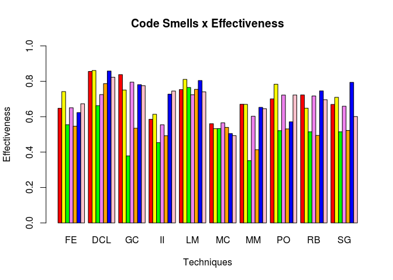

R Explorating Effectiveness
================
Rony Silva
06/11/2019

# Introduction

On this R Markdown, I describe some steps of usage of script
Effectiveness.R, available by Data Analysis class in the master’s
student program from the Federal University of Alagoas.

### Import libraries

Below the import of libraries from R, needed by the script is made.

<details>

<summary>Details import libraries</summary>

``` r
library(RWeka)
library(e1071)
library(gmodels)
library(caret)
```

    ## Loading required package: lattice

    ## Loading required package: ggplot2

``` r
library(irr)
```

    ## Loading required package: lpSolve

``` r
library(randomForest)
```

    ## randomForest 4.6-14

    ## Type rfNews() to see new features/changes/bug fixes.

    ## 
    ## Attaching package: 'randomForest'

    ## The following object is masked from 'package:ggplot2':
    ## 
    ##     margin

</details>

### Implemented Metrics

This script expose concepts related with performance of a model, to test
the performance the follow metrics are implemented like functions on
this script:

  - precision
  - recall
  - f\_measure
  - measures

<details>

<summary>Details Implemented Metrics</summary>

``` r
# Precision
precision <- function(tp, fp){
  
  precision <- tp/(tp+fp)
  
  return(precision)
}

# Recall
recall <- function(tp, fn){
  
  recall <- tp/(tp+fn)
  
  return(recall)
}

# F-measure
f_measure <- function(tp, fp, fn){
  
  f_measure <- (2*precision(tp,fp)*recall(tp,fn))/(recall(tp,fn) + precision(tp, fp))
  
  return(f_measure)
}

measures <- function(test, pred){
  
  true_positive <- 0
  true_negative <- 0
  false_positive <- 0
  false_negative <- 0
  
  for(i in 1:length(pred)){
    if(test[i] == TRUE && pred[i] == TRUE){
      true_positive <- true_positive + 1
    }else if(test[i] == FALSE && pred[i] == FALSE){
      true_negative <- true_negative + 1
    }else if(test[i] == FALSE && pred[i] == TRUE){
      false_negative <- false_negative + 1
    }else if(test[i] == TRUE && pred[i] == FALSE){
      false_positive <- false_positive + 1
    }
  }
  
  measures <- c(precision(true_positive,false_positive), 
                recall(true_positive,false_negative), 
                f_measure(true_positive,false_positive,false_negative))
  
  return(measures)
}
```

</details>

### Implemented Techniques

This script is responsible to evaluate how the dataset reacts to
utilization on each one of the following techniques.

  - J48
  - NaiveBayes
  - C50
  - SVM
  - OneR
  - JRip
  - RandomForest
  - SMO

<details>

<summary>Details Implemented Techniques</summary>

``` r
executeJ48 <- function(dataset, folds){
  results <- lapply(folds, function(x) {
    train <- dataset[-x, ]
    test <- dataset[x, ]
    model <- J48(train$Smell~ ., data = train)
    pred <- predict(model, test)
    
    results <- measures(test$Smell, pred)
    
    return(results)
  })
  
}


executeNaiveBayes <- function(dataset, folds){
  results <- lapply(folds, function(x) {
    train <- dataset[-x, ]
    test <- dataset[x, ]
    model <- naiveBayes(train, train$Smell, laplace = 1)
    pred <- predict(model, test)
    
    results <- measures(test$Smell, pred)
    
    return(results)
  })
  
}

executeC50 <- function(dataset, folds){
  results <- lapply(folds, function(x) {
    train <- dataset[-x, ]
    test <- dataset[x, ]
    model <- C5.0(train, train$Smell)
    pred <- predict(model, test)
    
    results <- measures(test$Smell, pred)
    
    return(results)
  })
  
}


executeSVM <- function(dataset, folds){
  results <- lapply(folds, function(x) {
    train <- dataset[-x, ]
    test <- dataset[x, ]
    model <- svm(train$Smell~ ., data = train)
    pred <- predict(model, test)
    
    results <- measures(test$Smell, pred)
    
    return(results)
  })
  
}

executeOneR <- function(dataset, folds){
  results <- lapply(folds, function(x) {
    train <- dataset[-x, ]
    test <- dataset[x, ]
    model <- OneR(train$Smell~ ., data = train)
    pred <- predict(model, test)
    
    results <- measures(test$Smell, pred)
    
    return(results)
  })
  
}

executeJRip <- function(dataset, folds){
  results <- lapply(folds, function(x) {
    train <- dataset[-x, ]
    test <- dataset[x, ]
    model <- JRip(train$Smell~ ., data = train)
    pred <- predict(model, test)
    
    results <- measures(test$Smell, pred)
    
    return(results)
  })
  
}

executeRandomForest <- function(dataset, folds){
  results <- lapply(folds, function(x) {
    train <- dataset[-x, ]
    test <- dataset[x, ]
    model <- randomForest(train$Smell~ ., data = train)
    pred <- predict(model, test)
    
    results <- measures(test$Smell, pred)
    
    return(results)
  })
}

executeSMO <- function(dataset, folds){
  results <- lapply(folds, function(x) {
    train <- dataset[-x, ]
    test <- dataset[x, ]
    model <- SMO(train$Smell~ ., data = train)
    pred <- predict(model, test)
    
    results <- measures(test$Smell, pred)
    
    return(results)
  })
}
```

</details>

# Analysis

### Techniques to be evaluated

Below are defined the techniques to be evaluated with the
dataset

``` r
techniques <- c("J48", "NaiveBayes", "SVM", "oneR", "JRip", "RandomForest", "SMO")
```

### Code Smells to be evaluated

According Martin Fowler, a code smell is a surface indication that
usually corresponds to a deeper problem in the system.

Exist more than 20 Code Smells types, this Script is responsible to
evaluate the following set of Code Smells:

  - FE. (Feature Envy)

  - 650. (Data Class)

  - GC. (God Class)

  - 2.  (Inappropriate Intimacy)

  - LM. (Long Method)

  - 1100. (Message Chains)

  - 2000. (Middle Man)

  - PO. (Primitive Obsession)

  - RB. (Refused Bequest)

  - SG. (Speculative Generality)

Below are defined the set of Smells to be verifyied.

``` r
smells <- c("FE", "DCL", "GC", "II","LM", "MC", "MM", "PO","RB","SG")
```

### A set of data

On R, a data.frame is a two dimensional data structure, where each
column represent a variable and each line a observation.

The data.frame below, represent a set of developers (columns) and the
total to each Smell type
(lines)

``` r
developers <- data.frame(c(1, 5, 6, 9, 55, 58, 60, 84, 97, 99, 101, 103),
                         c(2, 17, 18, 19, 21, 22, 27, 30, 77, 86, 93, 104),
                         c(1, 9, 13, 15, 16, 61, 62, 66, 84, 94, 102, 103),
                         c(2, 7, 21, 22, 24, 25, 28, 86, 104, 110, 111, 124),
                         c(41, 42, 43, 45, 46, 47, 49, 51, 64, 74, 81, 95),
                         c(5, 6, 10, 52, 53, 55, 58, 60, 91, 97, 99, 101),
                         c(8, 11, 39, 40, 41, 42, 43, 45, 46, 47, 74, 81),
                         c(46, 47, 49, 51, 52, 53, 64, 74, 91, 95, 105, 109),
                         c(13, 15, 16, 17, 18, 19, 30, 61, 94, 102, 111, 112),
                         c(5, 49, 51, 52, 53, 55, 56, 64, 91, 95, 99, 105))
```

### The Model Training

Below, the evaluation of each one of the previously defined Smells is
made on the data of each developer. The k-fold strategy to partition the
data is made, in this case (k = 5), then the dataset of each smell of
each developer is passed to each algorithm implementation with the
k-fold division.

<details>

<summary>Details Evaluation</summary>

``` r
colnames(developers) <- smells

list_of_results <- list()

for(j in 1:10){
  
  print(colnames(developers)[j])
  
  path <- paste("/home/rony/Documentos/data-analysis/Developers/",colnames(developers)[j],"/",colnames(developers)[j]," - ",sep="")
  
  results <- data.frame(0,0,0, 0, 0,0,0)
  
  
  for(q in 1:12){
    
    dev_path <- paste(path,developers[q,j],".csv",sep="")  
    dataset <- read.csv(dev_path, stringsAsFactors = FALSE)
    
    dataset$Smell <- factor(dataset$Smell)
    
    set.seed(3)
    folds <- createFolds(dataset$Smell, k =5)
    
    resultsJ48 <- executeJ48(dataset, folds)
    partial_results <- rowMeans(as.data.frame(resultsJ48), na.rm = TRUE)
    
    resultsNaiveBayes <- executeNaiveBayes(dataset, folds)
    partial_results <- rbind(partial_results, rowMeans(as.data.frame(resultsNaiveBayes), na.rm = TRUE) ) 
    
    resultsSVM <- executeSVM(dataset, folds)
    partial_results <- rbind(partial_results, rowMeans(as.data.frame(resultsSVM), na.rm = TRUE)) 
    
    resultsOneR <- executeOneR(dataset, folds)
    partial_results <- rbind(partial_results, rowMeans(as.data.frame(resultsOneR), na.rm = TRUE)) 
    
    resultsJRip <- executeJRip(dataset, folds)
    partial_results <- rbind(partial_results, rowMeans(as.data.frame(resultsJRip), na.rm = TRUE)) 
    
    resultsRandomForest <- executeRandomForest(dataset, folds)
    partial_results <- rbind(partial_results, rowMeans(as.data.frame(resultsRandomForest), na.rm = TRUE)) 
    
    resultsSMO <- executeSMO(dataset, folds)
    partial_results <- rbind(partial_results, rowMeans(as.data.frame(resultsSMO), na.rm = TRUE)) 
    
    rownames(partial_results) <- c("J48", "NaiveBayes", "SVM", "oneR", "JRip", "RandomForest","SMO")
    colnames(partial_results) <- c("Precision", "Recall", "F-measure")
    
    print(paste("Developer",developers[ q, j]))
    
    print(partial_results)
    
    results <- rbind(results, partial_results[,3])
  }
  
  results <- results[-1,]
  rownames(results) <- developers[ ,j]
  colnames(results) <- techniques
  results[,] <- lapply(results,function(x){ x[is.nan(x)]<-0;return(x)})
  
  list_of_results[[j]] <- results
  
}
```

    ## [1] "FE"

    ## Warning in svm.default(x, y, scale = scale, ..., na.action = na.action):
    ## Variable(s) 'Essential' constant. Cannot scale data.

    ## [1] "Developer 1"
    ##              Precision    Recall F-measure
    ## J48                0.6 0.5000000 0.6250000
    ## NaiveBayes         0.8 0.7916667 0.8666667
    ## SVM                0.8 0.7000000 0.6600000
    ## oneR               0.8 0.5000000 0.6583333
    ## JRip               0.7 0.4583333 0.5833333
    ## RandomForest       0.6 0.7083333 0.6666667
    ## SMO                0.8 0.6333333 0.6600000

    ## Warning in svm.default(x, y, scale = scale, ..., na.action = na.action):
    ## Variable(s) 'Essential' constant. Cannot scale data.

    ## [1] "Developer 5"
    ##              Precision    Recall F-measure
    ## J48                0.3 0.5000000 0.7500000
    ## NaiveBayes         0.5 0.3666667 0.6111111
    ## SVM                0.4 0.5000000 0.8333333
    ## oneR               0.6 0.2500000 0.5000000
    ## JRip               0.5 0.8333333 0.8333333
    ## RandomForest       0.5 0.5000000 0.7222222
    ## SMO                0.4 0.3333333 0.7500000

    ## Warning in svm.default(x, y, scale = scale, ..., na.action = na.action):
    ## Variable(s) 'Essential' constant. Cannot scale data.

    ## [1] "Developer 6"
    ##              Precision    Recall F-measure
    ## J48          0.4333333 0.7916667 0.6250000
    ## NaiveBayes   0.6333333 0.7500000 0.7333333
    ## SVM          1.0000000 0.7500000 0.8514286
    ## oneR         0.6000000 0.6666667 0.7000000
    ## JRip         0.9000000 0.7166667 0.7914286
    ## RandomForest 0.8000000 0.6833333 0.7314286
    ## SMO          0.7000000 0.6833333 0.6647619

    ## Warning in svm.default(x, y, scale = scale, ..., na.action = na.action):
    ## Variable(s) 'Essential' constant. Cannot scale data.

    ## [1] "Developer 9"
    ##              Precision    Recall F-measure
    ## J48                0.3 0.3333333 0.5833333
    ## NaiveBayes         0.3 0.2500000 0.5833333
    ## SVM                0.6 0.3888889 0.5555556
    ## oneR               0.0 0.0000000       NaN
    ## JRip               0.0       NaN       NaN
    ## RandomForest       0.2 0.1250000 0.6666667
    ## SMO                0.7 0.3333333 0.5416667

    ## Warning in svm.default(x, y, scale = scale, ..., na.action = na.action):
    ## Variable(s) 'Essential' constant. Cannot scale data.

    ## [1] "Developer 55"
    ##              Precision    Recall F-measure
    ## J48                0.7 0.6000000 0.7416667
    ## NaiveBayes         0.3 0.4000000 0.8333333
    ## SVM                0.9 0.5666667 0.6800000
    ## oneR               1.0 0.6000000 0.7400000
    ## JRip               1.0 0.6000000 0.7400000
    ## RandomForest       0.5 0.4333333 0.5750000
    ## SMO                0.5 0.3666667 0.5000000

    ## Warning in svm.default(x, y, scale = scale, ..., na.action = na.action):
    ## Variable(s) 'Essential' constant. Cannot scale data.

    ## [1] "Developer 58"
    ##              Precision    Recall F-measure
    ## J48                0.6 0.6000000 0.7083333
    ## NaiveBayes         0.6 0.5333333 0.6583333
    ## SVM                0.6 0.5000000 0.6166667
    ## oneR               0.8 0.5416667 0.6916667
    ## JRip               0.2 0.1666667 0.5000000
    ## RandomForest       0.5 0.4666667 0.5416667
    ## SMO                0.6 0.7500000 0.6666667

    ## Warning in svm.default(x, y, scale = scale, ..., na.action = na.action):
    ## Variable(s) 'Essential' constant. Cannot scale data.

    ## [1] "Developer 60"
    ##              Precision    Recall F-measure
    ## J48                0.2 0.3333333 1.0000000
    ## NaiveBayes         0.4 0.5000000 0.8333333
    ## SVM                0.0 0.0000000       NaN
    ## oneR               0.2 0.1111111 0.5000000
    ## JRip               0.2 0.3333333 1.0000000
    ## RandomForest       0.0 0.0000000       NaN
    ## SMO                0.2 0.1666667 0.5000000

    ## Warning in svm.default(x, y, scale = scale, ..., na.action = na.action):
    ## Variable(s) 'Essential' constant. Cannot scale data.

    ## [1] "Developer 84"
    ##              Precision    Recall F-measure
    ## J48                0.0 0.0000000       NaN
    ## NaiveBayes         0.9 0.5666667 0.6333333
    ## SVM                0.0 0.0000000       NaN
    ## oneR               0.5 0.6666667 0.7222222
    ## JRip               0.0 0.0000000       NaN
    ## RandomForest       0.3 0.3750000 0.6666667
    ## SMO                0.2 0.5000000 0.6666667

    ## Warning in svm.default(x, y, scale = scale, ..., na.action = na.action):
    ## Variable(s) 'Essential' constant. Cannot scale data.

    ## [1] "Developer 97"
    ##              Precision    Recall F-measure
    ## J48                0.6 0.5000000 0.8000000
    ## NaiveBayes         0.6 0.7083333 0.6916667
    ## SVM                1.0 0.6666667 0.8000000
    ## oneR               1.0 0.6666667 0.8000000
    ## JRip               1.0 0.6666667 0.8000000
    ## RandomForest       0.9 0.6333333 0.7400000
    ## SMO                0.8 0.6666667 0.8000000

    ## Warning in svm.default(x, y, scale = scale, ..., na.action = na.action):
    ## Variable(s) 'Essential' constant. Cannot scale data.

    ## [1] "Developer 99"
    ##              Precision    Recall F-measure
    ## J48                0.2 0.1666667 0.6666667
    ## NaiveBayes         0.9 0.7000000 0.7333333
    ## SVM                0.2 0.1666667 0.5000000
    ## oneR               0.4 1.0000000 1.0000000
    ## JRip               0.0 0.0000000       NaN
    ## RandomForest       0.5 0.6250000 0.7777778
    ## SMO                0.2 0.3333333 1.0000000

    ## Warning in svm.default(x, y, scale = scale, ..., na.action = na.action):
    ## Variable(s) 'Essential' constant. Cannot scale data.

    ## [1] "Developer 101"
    ##              Precision    Recall F-measure
    ## J48                0.5 0.3666667 0.6111111
    ## NaiveBayes         0.5 0.5000000 0.7777778
    ## SVM                0.4 0.3333333 0.5000000
    ## oneR               0.7 0.8750000 0.8333333
    ## JRip               0.3 0.6666667 0.5833333
    ## RandomForest       0.4 0.5000000 0.6666667
    ## SMO                0.2 0.1111111 0.5000000

    ## Warning in svm.default(x, y, scale = scale, ..., na.action = na.action):
    ## Variable(s) 'Essential' constant. Cannot scale data.

    ## [1] "Developer 103"
    ##              Precision    Recall F-measure
    ## J48                0.8 0.6333333 0.6600000
    ## NaiveBayes         0.8 0.9166667 0.9500000
    ## SVM                0.7 0.6250000 0.6583333
    ## oneR               0.8 0.6333333 0.6600000
    ## JRip               0.8 0.7333333 0.7266667
    ## RandomForest       0.8 0.7333333 0.7266667
    ## SMO                0.9 0.8333333 0.8266667
    ## [1] "DCL"

    ## Warning in svm.default(x, y, scale = scale, ..., na.action = na.action):
    ## Variable(s) 'CountDeclClassMethod' constant. Cannot scale data.

    ## Warning in svm.default(x, y, scale = scale, ..., na.action = na.action):
    ## Variable(s) 'CountDeclClassMethod' constant. Cannot scale data.
    
    ## Warning in svm.default(x, y, scale = scale, ..., na.action = na.action):
    ## Variable(s) 'CountDeclClassMethod' constant. Cannot scale data.

    ## Warning in svm.default(x, y, scale = scale, ..., na.action = na.action):
    ## Variable(s) 'CountClassBase' and 'CountDeclClassMethod' constant. Cannot
    ## scale data.

    ## Warning in svm.default(x, y, scale = scale, ..., na.action = na.action):
    ## Variable(s) 'CountDeclClassMethod' and 'CountDeclMethodPrivate' constant.
    ## Cannot scale data.

    ## [1] "Developer 2"
    ##              Precision    Recall F-measure
    ## J48                0.8 0.5833333 0.7250000
    ## NaiveBayes         0.5 0.6666667 0.8222222
    ## SVM                1.0 0.6000000 0.7400000
    ## oneR               0.9 0.8000000 0.7933333
    ## JRip               0.7 0.7083333 0.7333333
    ## RandomForest       0.8 0.9166667 0.9500000
    ## SMO                0.8 0.9333333 0.8266667

    ## Warning in svm.default(x, y, scale = scale, ..., na.action = na.action):
    ## Variable(s) 'CountDeclClassMethod' constant. Cannot scale data.

    ## Warning in svm.default(x, y, scale = scale, ..., na.action = na.action):
    ## Variable(s) 'CountDeclClassMethod' constant. Cannot scale data.
    
    ## Warning in svm.default(x, y, scale = scale, ..., na.action = na.action):
    ## Variable(s) 'CountDeclClassMethod' constant. Cannot scale data.

    ## Warning in svm.default(x, y, scale = scale, ..., na.action = na.action):
    ## Variable(s) 'CountDeclClassMethod' and 'CountDeclMethodPrivate' constant.
    ## Cannot scale data.

    ## Warning in svm.default(x, y, scale = scale, ..., na.action = na.action):
    ## Variable(s) 'CountClassBase' and 'CountDeclClassMethod' constant. Cannot
    ## scale data.

    ## [1] "Developer 17"
    ##              Precision    Recall F-measure
    ## J48                0.7 0.6666667 0.8166667
    ## NaiveBayes         0.7 0.7333333 0.8666667
    ## SVM                1.0 0.6000000 0.7400000
    ## oneR               0.7 0.6666667 0.8166667
    ## JRip               0.7 0.5666667 0.7750000
    ## RandomForest       0.7 0.6666667 0.8166667
    ## SMO                0.7 0.6333333 0.8250000

    ## Warning in svm.default(x, y, scale = scale, ..., na.action = na.action):
    ## Variable(s) 'CountDeclClassMethod' constant. Cannot scale data.

    ## Warning in svm.default(x, y, scale = scale, ..., na.action = na.action):
    ## Variable(s) 'CountDeclClassMethod' constant. Cannot scale data.

    ## Warning in svm.default(x, y, scale = scale, ..., na.action = na.action):
    ## Variable(s) 'CountClassBase' and 'CountDeclClassMethod' constant. Cannot
    ## scale data.

    ## Warning in svm.default(x, y, scale = scale, ..., na.action = na.action):
    ## Variable(s) 'CountDeclClassMethod' constant. Cannot scale data.

    ## Warning in svm.default(x, y, scale = scale, ..., na.action = na.action):
    ## Variable(s) 'CountDeclClassMethod' and 'CountDeclMethodPrivate' constant.
    ## Cannot scale data.

    ## [1] "Developer 18"
    ##              Precision    Recall F-measure
    ## J48          0.8666667 1.0000000 0.9000000
    ## NaiveBayes   0.8666667 0.9333333 0.8600000
    ## SVM          1.0000000 0.7500000 0.8514286
    ## oneR         1.0000000 0.8833333 0.9314286
    ## JRip         0.9000000 0.8166667 0.8247619
    ## RandomForest 1.0000000 0.8833333 0.9314286
    ## SMO          1.0000000 0.9500000 0.9714286

    ## Warning in svm.default(x, y, scale = scale, ..., na.action = na.action):
    ## Variable(s) 'CountClassBase' and 'CountDeclClassMethod' constant. Cannot
    ## scale data.
    
    ## Warning in svm.default(x, y, scale = scale, ..., na.action = na.action):
    ## Variable(s) 'CountDeclClassMethod' and 'CountDeclMethodPrivate' constant.
    ## Cannot scale data.

    ## Warning in svm.default(x, y, scale = scale, ..., na.action = na.action):
    ## Variable(s) 'CountDeclClassMethod' constant. Cannot scale data.
    
    ## Warning in svm.default(x, y, scale = scale, ..., na.action = na.action):
    ## Variable(s) 'CountDeclClassMethod' constant. Cannot scale data.
    
    ## Warning in svm.default(x, y, scale = scale, ..., na.action = na.action):
    ## Variable(s) 'CountDeclClassMethod' constant. Cannot scale data.

    ## [1] "Developer 19"
    ##              Precision    Recall F-measure
    ## J48                0.8 0.8750000 0.9166667
    ## NaiveBayes         0.9 0.9000000 0.8666667
    ## SVM                0.2 1.0000000 1.0000000
    ## oneR               0.6 0.5000000 0.7777778
    ## JRip               0.9 0.7333333 0.7600000
    ## RandomForest       1.0 0.9000000 0.9333333
    ## SMO                1.0 0.8000000 0.8666667

    ## Warning in svm.default(x, y, scale = scale, ..., na.action = na.action):
    ## Variable(s) 'CountDeclClassMethod' constant. Cannot scale data.
    
    ## Warning in svm.default(x, y, scale = scale, ..., na.action = na.action):
    ## Variable(s) 'CountDeclClassMethod' constant. Cannot scale data.
    
    ## Warning in svm.default(x, y, scale = scale, ..., na.action = na.action):
    ## Variable(s) 'CountDeclClassMethod' constant. Cannot scale data.

    ## Warning in svm.default(x, y, scale = scale, ..., na.action = na.action):
    ## Variable(s) 'CountDeclClassMethod' and 'CountDeclMethodPrivate' constant.
    ## Cannot scale data.

    ## Warning in svm.default(x, y, scale = scale, ..., na.action = na.action):
    ## Variable(s) 'CountClassBase' and 'CountDeclClassMethod' constant. Cannot
    ## scale data.

    ## [1] "Developer 21"
    ##              Precision    Recall F-measure
    ## J48                0.8 1.0000000 0.8666667
    ## NaiveBayes         0.9 1.0000000 0.9333333
    ## SVM                1.0 0.6000000 0.7400000
    ## oneR               0.9 0.8333333 0.8266667
    ## JRip               0.9 0.8333333 0.8266667
    ## RandomForest       0.9 1.0000000 0.9333333
    ## SMO                0.9 0.9333333 0.8933333

    ## Warning in svm.default(x, y, scale = scale, ..., na.action = na.action):
    ## Variable(s) 'CountDeclClassMethod' constant. Cannot scale data.
    
    ## Warning in svm.default(x, y, scale = scale, ..., na.action = na.action):
    ## Variable(s) 'CountClassBase' and 'CountDeclClassMethod' constant. Cannot
    ## scale data.

    ## Warning in svm.default(x, y, scale = scale, ..., na.action =
    ## na.action): Variable(s) 'AvgEssential' and 'CountDeclClassMethod' and
    ## 'CountDeclMethodPrivate' and 'MaxEssential' constant. Cannot scale data.

    ## Warning in svm.default(x, y, scale = scale, ..., na.action = na.action):
    ## Variable(s) 'CountDeclClassMethod' constant. Cannot scale data.
    
    ## Warning in svm.default(x, y, scale = scale, ..., na.action = na.action):
    ## Variable(s) 'CountDeclClassMethod' constant. Cannot scale data.

    ## [1] "Developer 22"
    ##              Precision    Recall F-measure
    ## J48                0.8 0.8666667 0.7866667
    ## NaiveBayes         0.4 0.6250000 0.5416667
    ## SVM                1.0 0.6000000 0.7400000
    ## oneR               0.8 0.5333333 0.6200000
    ## JRip               0.8 0.7333333 0.6866667
    ## RandomForest       0.4 0.5000000 0.5416667
    ## SMO                0.6 0.5666667 0.5333333

    ## Warning in svm.default(x, y, scale = scale, ..., na.action = na.action):
    ## Variable(s) 'CountClassBase' and 'CountDeclClassMethod' constant. Cannot
    ## scale data.
    
    ## Warning in svm.default(x, y, scale = scale, ..., na.action = na.action):
    ## Variable(s) 'CountDeclClassMethod' constant. Cannot scale data.
    
    ## Warning in svm.default(x, y, scale = scale, ..., na.action = na.action):
    ## Variable(s) 'CountDeclClassMethod' constant. Cannot scale data.

    ## Warning in svm.default(x, y, scale = scale, ..., na.action = na.action):
    ## Variable(s) 'CountDeclClassMethod' and 'CountDeclMethodPrivate' constant.
    ## Cannot scale data.

    ## Warning in svm.default(x, y, scale = scale, ..., na.action = na.action):
    ## Variable(s) 'CountDeclClassMethod' constant. Cannot scale data.

    ## [1] "Developer 27"
    ##              Precision    Recall F-measure
    ## J48                0.6 1.0000000 1.0000000
    ## NaiveBayes         1.0 0.9000000 0.9333333
    ## SVM                0.0       NaN       NaN
    ## oneR               0.0 0.0000000       NaN
    ## JRip               0.8 0.7083333 0.7916667
    ## RandomForest       0.8 0.7500000 0.8333333
    ## SMO                0.8 0.6250000 0.7500000

    ## Warning in svm.default(x, y, scale = scale, ..., na.action =
    ## na.action): Variable(s) 'CountClassBase' and 'CountDeclClassMethod' and
    ## 'CountDeclMethodPrivate' constant. Cannot scale data.
    
    ## Warning in svm.default(x, y, scale = scale, ..., na.action = na.action):
    ## Variable(s) 'CountDeclClassMethod' constant. Cannot scale data.
    
    ## Warning in svm.default(x, y, scale = scale, ..., na.action = na.action):
    ## Variable(s) 'CountDeclClassMethod' constant. Cannot scale data.
    
    ## Warning in svm.default(x, y, scale = scale, ..., na.action = na.action):
    ## Variable(s) 'CountDeclClassMethod' constant. Cannot scale data.
    
    ## Warning in svm.default(x, y, scale = scale, ..., na.action = na.action):
    ## Variable(s) 'CountDeclClassMethod' constant. Cannot scale data.

    ## [1] "Developer 30"
    ##              Precision    Recall F-measure
    ## J48                0.4 0.5000000 0.8333333
    ## NaiveBayes         1.0 0.8000000 0.8666667
    ## SVM                0.0       NaN       NaN
    ## oneR               0.2 0.2500000 0.6666667
    ## JRip               0.4 0.5000000 0.8333333
    ## RandomForest       0.8 0.7500000 0.8333333
    ## SMO                1.0 0.7666667 0.8333333

    ## Warning in svm.default(x, y, scale = scale, ..., na.action = na.action):
    ## Variable(s) 'CountDeclClassMethod' constant. Cannot scale data.

    ## Warning in svm.default(x, y, scale = scale, ..., na.action = na.action):
    ## Variable(s) 'CountDeclClassMethod' and 'CountDeclMethodPrivate' constant.
    ## Cannot scale data.

    ## Warning in svm.default(x, y, scale = scale, ..., na.action = na.action):
    ## Variable(s) 'CountDeclClassMethod' constant. Cannot scale data.
    
    ## Warning in svm.default(x, y, scale = scale, ..., na.action = na.action):
    ## Variable(s) 'CountDeclClassMethod' constant. Cannot scale data.

    ## Warning in svm.default(x, y, scale = scale, ..., na.action = na.action):
    ## Variable(s) 'CountClassBase' and 'CountDeclClassMethod' constant. Cannot
    ## scale data.

    ## [1] "Developer 77"
    ##              Precision    Recall F-measure
    ## J48          0.6000000 0.7333333 0.7750000
    ## NaiveBayes   0.4333333 0.6666667 0.7777778
    ## SVM          1.0000000 0.8166667 0.8914286
    ## oneR         0.8666667 0.8166667 0.7914286
    ## JRip         1.0000000 0.8166667 0.8914286
    ## RandomForest 0.8333333 0.7833333 0.7914286
    ## SMO          0.7666667 0.8166667 0.7247619

    ## Warning in svm.default(x, y, scale = scale, ..., na.action = na.action):
    ## Variable(s) 'CountDeclClassMethod' constant. Cannot scale data.

    ## Warning in svm.default(x, y, scale = scale, ..., na.action = na.action):
    ## Variable(s) 'CountDeclClassMethod' constant. Cannot scale data.
    
    ## Warning in svm.default(x, y, scale = scale, ..., na.action = na.action):
    ## Variable(s) 'CountDeclClassMethod' constant. Cannot scale data.

    ## Warning in svm.default(x, y, scale = scale, ..., na.action = na.action):
    ## Variable(s) 'CountDeclClassMethod' and 'CountDeclMethodPrivate' constant.
    ## Cannot scale data.

    ## Warning in svm.default(x, y, scale = scale, ..., na.action = na.action):
    ## Variable(s) 'CountClassBase' and 'CountDeclClassMethod' constant. Cannot
    ## scale data.

    ## [1] "Developer 86"
    ##              Precision    Recall F-measure
    ## J48                0.8 1.0000000 0.8666667
    ## NaiveBayes         0.9 1.0000000 0.9333333
    ## SVM                1.0 0.6000000 0.7400000
    ## oneR               0.9 0.8333333 0.8266667
    ## JRip               0.9 0.8333333 0.8266667
    ## RandomForest       0.9 1.0000000 0.9333333
    ## SMO                0.9 0.9333333 0.8933333

    ## Warning in svm.default(x, y, scale = scale, ..., na.action = na.action):
    ## Variable(s) 'CountClassBase' and 'CountDeclClassMethod' constant. Cannot
    ## scale data.

    ## Warning in svm.default(x, y, scale = scale, ..., na.action = na.action):
    ## Variable(s) 'CountDeclClassMethod' constant. Cannot scale data.
    
    ## Warning in svm.default(x, y, scale = scale, ..., na.action = na.action):
    ## Variable(s) 'CountDeclClassMethod' constant. Cannot scale data.

    ## Warning in svm.default(x, y, scale = scale, ..., na.action = na.action):
    ## Variable(s) 'CountDeclClassMethod' and 'CountDeclMethodPrivate' constant.
    ## Cannot scale data.

    ## Warning in svm.default(x, y, scale = scale, ..., na.action = na.action):
    ## Variable(s) 'CountDeclClassMethod' constant. Cannot scale data.

    ## [1] "Developer 93"
    ##              Precision    Recall F-measure
    ## J48                0.8 0.8750000 0.9166667
    ## NaiveBayes         0.6 1.0000000 1.0000000
    ## SVM                1.0 0.6666667 0.7666667
    ## oneR               0.8 0.7500000 0.8250000
    ## JRip               0.6 0.7083333 0.6666667
    ## RandomForest       0.8 0.7916667 0.8666667
    ## SMO                0.8 0.7916667 0.8666667

    ## Warning in svm.default(x, y, scale = scale, ..., na.action = na.action):
    ## Variable(s) 'CountDeclClassMethod' constant. Cannot scale data.
    
    ## Warning in svm.default(x, y, scale = scale, ..., na.action = na.action):
    ## Variable(s) 'CountDeclClassMethod' constant. Cannot scale data.
    
    ## Warning in svm.default(x, y, scale = scale, ..., na.action = na.action):
    ## Variable(s) 'CountDeclClassMethod' constant. Cannot scale data.

    ## Warning in svm.default(x, y, scale = scale, ..., na.action = na.action):
    ## Variable(s) 'CountDeclClassMethod' and 'CountDeclMethodPrivate' constant.
    ## Cannot scale data.

    ## Warning in svm.default(x, y, scale = scale, ..., na.action = na.action):
    ## Variable(s) 'CountClassBase' and 'CountDeclClassMethod' constant. Cannot
    ## scale data.

    ## [1] "Developer 104"
    ##              Precision    Recall F-measure
    ## J48                0.8 1.0000000 0.8666667
    ## NaiveBayes         0.9 1.0000000 0.9333333
    ## SVM                1.0 0.6000000 0.7400000
    ## oneR               0.9 0.8333333 0.8266667
    ## JRip               0.9 0.8333333 0.8266667
    ## RandomForest       0.9 1.0000000 0.9333333
    ## SMO                0.9 0.9333333 0.8933333
    ## [1] "GC"

    ## Warning in svm.default(x, y, scale = scale, ..., na.action = na.action):
    ## Variable(s) 'CountDeclClassMethod' constant. Cannot scale data.

    ## [1] "Developer 1"
    ##              Precision    Recall F-measure
    ## J48               1.00 0.8750000 0.9166667
    ## NaiveBayes        1.00 0.8333333 0.8750000
    ## SVM               0.25 0.5000000 0.6666667
    ## oneR              0.75 0.8333333 0.8888889
    ## JRip              0.00       NaN       NaN
    ## RandomForest      0.50 0.6666667 1.0000000
    ## SMO               0.75 0.7500000 1.0000000

    ## Warning in svm.default(x, y, scale = scale, ..., na.action = na.action):
    ## Variable(s) 'CountDeclClassMethod' constant. Cannot scale data.

    ## [1] "Developer 9"
    ##              Precision Recall F-measure
    ## J48                0.4  1.000 1.0000000
    ## NaiveBayes         1.0  0.900 0.9333333
    ## SVM                0.8  1.000 1.0000000
    ## oneR               1.0  1.000 1.0000000
    ## JRip               1.0  1.000 1.0000000
    ## RandomForest       1.0  1.000 1.0000000
    ## SMO                0.8  0.875 0.9166667

    ## Warning in svm.default(x, y, scale = scale, ..., na.action = na.action):
    ## Variable(s) 'CountDeclClassMethod' constant. Cannot scale data.

    ## [1] "Developer 13"
    ##              Precision    Recall F-measure
    ## J48                0.6 0.4000000 0.7777778
    ## NaiveBayes         0.6 0.5000000 0.7777778
    ## SVM                0.0       NaN       NaN
    ## oneR               0.6 0.5000000 0.7777778
    ## JRip               0.4 0.3333333 0.6666667
    ## RandomForest       0.4 0.7500000 0.8333333
    ## SMO                0.2 0.1250000 0.6666667

    ## Warning in svm.default(x, y, scale = scale, ..., na.action = na.action):
    ## Variable(s) 'CountDeclClassMethod' constant. Cannot scale data.

    ## [1] "Developer 15"
    ##              Precision    Recall F-measure
    ## J48                0.6 0.5000000 0.7777778
    ## NaiveBayes         0.2 0.1666667 0.6666667
    ## SVM                0.0       NaN       NaN
    ## oneR               0.4 0.2777778 0.5833333
    ## JRip               0.2 0.3333333 0.5000000
    ## RandomForest       0.2 0.5000000 1.0000000
    ## SMO                0.4 0.6666667 1.0000000

    ## Warning in svm.default(x, y, scale = scale, ..., na.action = na.action):
    ## Variable(s) 'CountDeclClassMethod' constant. Cannot scale data.

    ## [1] "Developer 16"
    ##              Precision Recall F-measure
    ## J48                0.4  1.000 1.0000000
    ## NaiveBayes         1.0  0.900 0.9333333
    ## SVM                0.8  1.000 1.0000000
    ## oneR               1.0  1.000 1.0000000
    ## JRip               1.0  1.000 1.0000000
    ## RandomForest       1.0  1.000 1.0000000
    ## SMO                0.8  0.875 0.9166667

    ## Warning in svm.default(x, y, scale = scale, ..., na.action = na.action):
    ## Variable(s) 'CountDeclClassMethod' constant. Cannot scale data.

    ## [1] "Developer 61"
    ##              Precision    Recall F-measure
    ## J48               0.25 0.2500000 1.0000000
    ## NaiveBayes        0.00 0.0000000       NaN
    ## SVM               0.00       NaN       NaN
    ## oneR              0.25 0.1666667 0.6666667
    ## JRip              0.00 0.0000000       NaN
    ## RandomForest      0.00 0.0000000       NaN
    ## SMO               0.00 0.0000000       NaN

    ## Warning in svm.default(x, y, scale = scale, ..., na.action = na.action):
    ## Variable(s) 'CountDeclClassMethod' constant. Cannot scale data.

    ## [1] "Developer 62"
    ##              Precision    Recall F-measure
    ## J48                0.6 0.3666667 0.7222222
    ## NaiveBayes         0.5 0.5000000 0.8333333
    ## SVM                0.0       NaN       NaN
    ## oneR               0.2 0.5000000 1.0000000
    ## JRip               0.0 0.0000000       NaN
    ## RandomForest       0.3 0.2777778 0.5000000
    ## SMO                0.4 0.2000000 0.6666667

    ## Warning in svm.default(x, y, scale = scale, ..., na.action = na.action):
    ## Variable(s) 'CountDeclClassMethod' constant. Cannot scale data.

    ## [1] "Developer 66"
    ##              Precision    Recall F-measure
    ## J48          1.0000000 0.8333333 0.8888889
    ## NaiveBayes   0.6666667 0.5000000 0.8333333
    ## SVM          0.0000000       NaN       NaN
    ## oneR         0.6666667 0.7500000 0.8333333
    ## JRip         0.3333333 1.0000000 1.0000000
    ## RandomForest 0.6666667 1.0000000 1.0000000
    ## SMO          0.6666667 0.5000000 0.8333333

    ## Warning in svm.default(x, y, scale = scale, ..., na.action = na.action):
    ## Variable(s) 'CountDeclClassMethod' constant. Cannot scale data.

    ## [1] "Developer 84"
    ##              Precision    Recall F-measure
    ## J48                0.4 0.3750000 0.8333333
    ## NaiveBayes         0.4 0.4444444 0.7500000
    ## SVM                0.0       NaN       NaN
    ## oneR               0.4 0.2777778 0.5833333
    ## JRip               0.2 0.2500000 0.6666667
    ## RandomForest       0.4 0.6666667 0.7500000
    ## SMO                0.6 0.6250000 0.8888889

    ## Warning in svm.default(x, y, scale = scale, ..., na.action = na.action):
    ## Variable(s) 'CountDeclClassMethod' constant. Cannot scale data.

    ## [1] "Developer 94"
    ##              Precision    Recall F-measure
    ## J48                0.7 0.7083333 0.7083333
    ## NaiveBayes         0.8 0.7083333 0.7916667
    ## SVM                0.8 0.8333333 0.8750000
    ## oneR               0.7 0.8750000 0.8333333
    ## JRip               0.8 0.7083333 0.7916667
    ## RandomForest       0.8 0.8750000 0.9166667
    ## SMO                0.8 0.7500000 0.8333333

    ## Warning in svm.default(x, y, scale = scale, ..., na.action = na.action):
    ## Variable(s) 'CountDeclClassMethod' constant. Cannot scale data.

    ## [1] "Developer 102"
    ##              Precision    Recall F-measure
    ## J48                0.6 0.6111111 0.7222222
    ## NaiveBayes         0.2 0.1666667 0.6666667
    ## SVM                0.0       NaN       NaN
    ## oneR               0.2 0.1666667 0.6666667
    ## JRip               0.0       NaN       NaN
    ## RandomForest       0.2 0.3333333 0.5000000
    ## SMO                0.2 0.2500000 0.6666667

    ## Warning in svm.default(x, y, scale = scale, ..., na.action = na.action):
    ## Variable(s) 'CountDeclClassMethod' constant. Cannot scale data.

    ## [1] "Developer 103"
    ##              Precision    Recall F-measure
    ## J48                0.7 0.7083333 0.7083333
    ## NaiveBayes         0.8 0.9166667 0.9500000
    ## SVM                0.8 1.0000000 1.0000000
    ## oneR               0.7 0.7083333 0.7083333
    ## JRip               0.8 0.7083333 0.7916667
    ## RandomForest       0.8 0.8333333 0.8750000
    ## SMO                0.7 1.0000000 0.9166667
    ## [1] "II"
    ## [1] "Developer 2"
    ##              Precision    Recall F-measure
    ## J48                0.4 0.3000000 0.5666667
    ## NaiveBayes         0.6 0.4000000 0.5833333
    ## SVM                0.7 0.4583333 0.5833333
    ## oneR               1.0 0.6333333 0.7533333
    ## JRip               0.8 0.5000000 0.6583333
    ## RandomForest       0.7 0.5333333 0.6916667
    ## SMO                0.8 0.6000000 0.6266667
    ## [1] "Developer 7"
    ##              Precision    Recall F-measure
    ## J48                0.3 0.3333333 0.7333333
    ## NaiveBayes         0.6 0.5833333 0.8666667
    ## SVM                0.0 0.0000000       NaN
    ## oneR               0.4 0.5833333 0.6111111
    ## JRip               0.1 0.5000000 0.6666667
    ## RandomForest       0.5 0.4000000 0.7222222
    ## SMO                0.6 0.4666667 0.5833333
    ## [1] "Developer 21"
    ##              Precision    Recall F-measure
    ## J48                0.3 0.3333333 0.7333333
    ## NaiveBayes         0.6 0.6333333 0.7416667
    ## SVM                0.9 0.6666667 0.7133333
    ## oneR               0.6 0.4333333 0.6166667
    ## JRip               0.9 0.5666667 0.6800000
    ## RandomForest       0.5 0.6333333 0.6583333
    ## SMO                0.8 0.8000000 0.7266667
    ## [1] "Developer 22"
    ##              Precision    Recall F-measure
    ## J48          0.0000000 0.0000000       NaN
    ## NaiveBayes   0.0000000       NaN       NaN
    ## SVM          0.0000000       NaN       NaN
    ## oneR         0.0000000 0.0000000       NaN
    ## JRip         0.0000000       NaN       NaN
    ## RandomForest 0.0000000 0.0000000       NaN
    ## SMO          0.3333333 0.1666667 0.6666667
    ## [1] "Developer 24"
    ##              Precision    Recall F-measure
    ## J48                0.6 0.6250000 0.8888889
    ## NaiveBayes         0.6 0.5833333 0.8333333
    ## SVM                0.0 0.0000000       NaN
    ## oneR               0.2 0.1666667 0.6666667
    ## JRip               0.0       NaN       NaN
    ## RandomForest       0.6 0.7500000 1.0000000
    ## SMO                0.6 0.5000000 0.7777778
    ## [1] "Developer 25"
    ##              Precision    Recall F-measure
    ## J48                0.5 0.3750000 0.6111111
    ## NaiveBayes         0.5 0.3888889 0.5222222
    ## SVM                0.6 0.6111111 0.7222222
    ## oneR               0.5 0.5000000 0.6666667
    ## JRip               0.7 0.4583333 0.5833333
    ## RandomForest       0.8 0.7000000 0.6666667
    ## SMO                0.9 0.7666667 0.7666667
    ## [1] "Developer 28"
    ##              Precision    Recall F-measure
    ## J48                0.7 0.5833333 0.6666667
    ## NaiveBayes         0.8 0.5000000 0.7416667
    ## SVM                0.6 0.6111111 0.7222222
    ## oneR               0.6 0.6666667 0.9333333
    ## JRip               0.1 0.5000000 0.6666667
    ## RandomForest       0.6 0.7222222 0.8222222
    ## SMO                0.8 0.7500000 0.8333333
    ## [1] "Developer 86"
    ##              Precision    Recall F-measure
    ## J48                0.4 0.4166667 0.5833333
    ## NaiveBayes         0.6 0.6250000 0.8888889
    ## SVM                0.2 0.5000000 0.6666667
    ## oneR               0.4 0.4166667 0.5833333
    ## JRip               0.4 0.4166667 0.5833333
    ## RandomForest       0.6 0.6666667 0.7777778
    ## SMO                0.4 0.7500000 0.8333333
    ## [1] "Developer 104"
    ##              Precision    Recall F-measure
    ## J48               0.00 0.0000000       NaN
    ## NaiveBayes        0.00 0.0000000       NaN
    ## SVM               0.00       NaN       NaN
    ## oneR              0.00 0.0000000       NaN
    ## JRip              0.00 0.0000000       NaN
    ## RandomForest      0.25 0.3333333 1.0000000
    ## SMO               0.25 0.1666667 0.6666667
    ## [1] "Developer 110"
    ##              Precision    Recall F-measure
    ## J48                0.4 0.3750000 0.8333333
    ## NaiveBayes         0.8 0.8000000 0.7666667
    ## SVM                0.6 0.5000000 0.6555556
    ## oneR               0.2 0.3333333 0.5333333
    ## JRip               0.6 0.6000000 0.6666667
    ## RandomForest       0.7 0.6333333 0.7833333
    ## SMO                0.4 0.7500000 0.7777778
    ## [1] "Developer 111"
    ##              Precision    Recall F-measure
    ## J48                0.4 0.6666667 0.7111111
    ## NaiveBayes         0.9 0.7333333 0.7533333
    ## SVM                0.8 0.6333333 0.6533333
    ## oneR               0.4 0.7222222 0.6555556
    ## JRip               0.9 0.6666667 0.7133333
    ## RandomForest       0.8 0.7500000 0.8250000
    ## SMO                0.5 0.6250000 0.8333333
    ## [1] "Developer 124"
    ##              Precision    Recall F-measure
    ## J48                0.8 0.7000000 0.7000000
    ## NaiveBayes         0.6 0.5000000 0.6666667
    ## SVM                0.6 0.4583333 0.7222222
    ## oneR               0.8 0.6000000 0.6333333
    ## JRip               0.8 0.5416667 0.6916667
    ## RandomForest       0.7 0.6333333 0.7833333
    ## SMO                0.8 0.7500000 0.8500000
    ## [1] "LM"
    ## [1] "Developer 41"
    ##              Precision    Recall F-measure
    ## J48                0.6 0.7916667 0.7416667
    ## NaiveBayes         0.5 0.4583333 0.7000000
    ## SVM                0.6 0.4000000 0.8000000
    ## oneR               0.7 0.5000000 0.7250000
    ## JRip               0.9 0.6333333 0.7400000
    ## RandomForest       0.6 0.5833333 0.6500000
    ## SMO                0.5 0.4583333 0.7000000

    ## Warning in svm.default(x, y, scale = scale, ..., na.action = na.action):
    ## Variable(s) 'Essential' constant. Cannot scale data.

    ## [1] "Developer 42"
    ##              Precision    Recall F-measure
    ## J48          0.9333333 0.8000000 0.8533333
    ## NaiveBayes   1.0000000 0.8666667 0.9200000
    ## SVM          1.0000000 0.8166667 0.8914286
    ## oneR         1.0000000 0.8166667 0.8914286
    ## JRip         0.9333333 0.8000000 0.8533333
    ## RandomForest 0.9333333 1.0000000 0.9600000
    ## SMO          0.9333333 0.8166667 0.8514286
    ## [1] "Developer 43"
    ##              Precision    Recall F-measure
    ## J48                0.9 0.7666667 0.8200000
    ## NaiveBayes         0.7 0.8750000 0.8750000
    ## SVM                0.8 0.6333333 0.8666667
    ## oneR               0.7 0.5666667 0.7083333
    ## JRip               0.8 0.6666667 0.6666667
    ## RandomForest       0.8 0.7333333 0.9500000
    ## SMO                0.9 0.8000000 0.8333333
    ## [1] "Developer 45"
    ##              Precision    Recall F-measure
    ## J48                0.5 0.5416667 0.7666667
    ## NaiveBayes         0.6 0.8000000 0.8333333
    ## SVM                0.8 0.6000000 0.6800000
    ## oneR               0.8 0.5333333 0.8000000
    ## JRip               0.6 0.5000000 0.8000000
    ## RandomForest       0.7 0.6000000 0.7666667
    ## SMO                0.8 0.7000000 0.7133333
    ## [1] "Developer 46"
    ##              Precision    Recall F-measure
    ## J48                1.0 0.7333333 0.8266667
    ## NaiveBayes         0.6 0.8750000 0.7916667
    ## SVM                0.9 0.7333333 0.7933333
    ## oneR               0.5 0.4444444 0.5555556
    ## JRip               0.8 0.6333333 0.6933333
    ## RandomForest       0.9 0.9000000 0.9000000
    ## SMO                0.6 0.6000000 0.7500000
    ## [1] "Developer 47"
    ##              Precision    Recall F-measure
    ## J48          0.9000000 0.7833333 0.8314286
    ## NaiveBayes   0.8000000 0.9000000 0.8333333
    ## SVM          0.9000000 0.7166667 0.7914286
    ## oneR         0.9333333 0.7333333 0.8133333
    ## JRip         0.9000000 0.7166667 0.7914286
    ## RandomForest 0.8000000 0.8541667 0.9142857
    ## SMO          0.8333333 0.8000000 0.7866667
    ## [1] "Developer 49"
    ##              Precision    Recall F-measure
    ## J48                0.5 0.4583333 0.6111111
    ## NaiveBayes         0.5 0.8333333 0.7777778
    ## SVM                0.5 0.8333333 0.7777778
    ## oneR               0.6 0.6666667 0.7777778
    ## JRip               0.6 0.6666667 0.7777778
    ## RandomForest       0.5 0.6666667 0.6666667
    ## SMO                0.4 0.5000000 0.8333333
    ## [1] "Developer 51"
    ##              Precision    Recall F-measure
    ## J48                0.7 0.7916667 0.7833333
    ## NaiveBayes         0.5 0.8888889 0.8222222
    ## SVM                0.8 0.7333333 0.6866667
    ## oneR               0.8 0.6333333 0.6533333
    ## JRip               0.8 0.7083333 0.8166667
    ## RandomForest       0.8 0.8333333 0.7600000
    ## SMO                0.6 0.7500000 0.6583333
    ## [1] "Developer 64"
    ##              Precision    Recall F-measure
    ## J48          0.9000000 0.8333333 0.8600000
    ## NaiveBayes   1.0000000 0.8666667 0.9200000
    ## SVM          0.9000000 0.7166667 0.7914286
    ## oneR         0.7666667 0.8000000 0.7133333
    ## JRip         0.9000000 0.9000000 0.9000000
    ## RandomForest 0.9000000 1.0000000 0.9333333
    ## SMO          0.6333333 0.7333333 0.8333333
    ## [1] "Developer 74"
    ##              Precision    Recall F-measure
    ## J48                0.8 0.5333333 0.6200000
    ## NaiveBayes         0.5 0.7222222 0.7111111
    ## SVM                0.9 0.8333333 0.8266667
    ## oneR               0.7 0.4333333 0.6500000
    ## JRip               0.8 0.5333333 0.6200000
    ## RandomForest       0.8 0.8333333 0.7933333
    ## SMO                0.5 0.6666667 0.6555556
    ## [1] "Developer 81"
    ##              Precision    Recall F-measure
    ## J48                0.5 0.7500000 0.6250000
    ## NaiveBayes         0.6 0.5416667 0.8222222
    ## SVM                0.9 0.6333333 0.7200000
    ## oneR               0.9 0.7666667 0.7866667
    ## JRip               1.0 0.6000000 0.7400000
    ## RandomForest       0.7 0.6000000 0.7416667
    ## SMO                0.6 0.7222222 0.8222222
    ## [1] "Developer 95"
    ##              Precision    Recall F-measure
    ## J48                0.6 0.3333333 0.7000000
    ## NaiveBayes         0.5 0.5833333 0.7222222
    ## SVM                0.5 0.2666667 0.5555556
    ## oneR               0.5 0.3666667 0.6111111
    ## JRip               0.6 0.3000000 0.6555556
    ## RandomForest       0.6 0.4333333 0.6166667
    ## SMO                0.2 0.1666667 0.4500000
    ## [1] "MC"
    ## [1] "Developer 5"
    ##              Precision    Recall F-measure
    ## J48                1.0 0.9000000 0.9333333
    ## NaiveBayes         0.2 0.1666667 0.5000000
    ## SVM                0.4 0.6666667 0.7500000
    ## oneR               0.8 0.7500000 0.8333333
    ## JRip               0.8 0.7500000 0.8333333
    ## RandomForest       0.8 0.7500000 0.8333333
    ## SMO                0.4 0.7500000 0.8333333
    ## [1] "Developer 6"
    ##              Precision    Recall F-measure
    ## J48          0.8333333 0.8666667 0.8133333
    ## NaiveBayes   0.5666667 0.7500000 0.6047619
    ## SVM          1.0000000 0.8166667 0.8914286
    ## oneR         1.0000000 0.8166667 0.8914286
    ## JRip         0.9000000 0.8166667 0.8247619
    ## RandomForest 1.0000000 0.8166667 0.8914286
    ## SMO          1.0000000 0.8166667 0.8914286
    ## [1] "Developer 10"
    ##              Precision Recall F-measure
    ## J48                  0      0       NaN
    ## NaiveBayes           0      0       NaN
    ## SVM                  0    NaN       NaN
    ## oneR                 0      0       NaN
    ## JRip                 0    NaN       NaN
    ## RandomForest         0      0       NaN
    ## SMO                  0    NaN       NaN
    ## [1] "Developer 52"
    ##              Precision    Recall F-measure
    ## J48                0.8 0.9166667 0.9500000
    ## NaiveBayes         0.9 0.8166667 0.8247619
    ## SVM                1.0 0.7500000 0.8514286
    ## oneR               1.0 0.9333333 0.9600000
    ## JRip               1.0 0.8833333 0.9314286
    ## RandomForest       0.8 0.6166667 0.8642857
    ## SMO                1.0 0.8166667 0.8914286
    ## [1] "Developer 53"
    ##              Precision Recall F-measure
    ## J48                  0      0       NaN
    ## NaiveBayes           0      0       NaN
    ## SVM                  0    NaN       NaN
    ## oneR                 0      0       NaN
    ## JRip                 0      0       NaN
    ## RandomForest         0    NaN       NaN
    ## SMO                  0    NaN       NaN
    ## [1] "Developer 55"
    ##              Precision    Recall F-measure
    ## J48                0.5 0.3666667 0.7000000
    ## NaiveBayes         0.2 0.6666667 0.6666667
    ## SVM                1.0 0.6000000 0.7400000
    ## oneR               0.5 0.4666667 0.5416667
    ## JRip               1.0 0.6000000 0.7400000
    ## RandomForest       0.4 0.2666667 0.5000000
    ## SMO                0.6 0.4000000 0.5750000
    ## [1] "Developer 58"
    ##              Precision Recall F-measure
    ## J48          0.3333333   0.25 0.6666667
    ## NaiveBayes   0.3333333   0.25 1.0000000
    ## SVM          0.0000000    NaN       NaN
    ## oneR         0.0000000   0.00       NaN
    ## JRip         0.0000000   0.00       NaN
    ## RandomForest 0.0000000    NaN       NaN
    ## SMO          0.0000000   0.00       NaN
    ## [1] "Developer 60"
    ##              Precision    Recall F-measure
    ## J48                0.0 0.0000000       NaN
    ## NaiveBayes         0.0 0.0000000       NaN
    ## SVM                0.4 0.2916667 0.7333333
    ## oneR               0.4 0.2083333 0.5833333
    ## JRip               0.6 0.4444444 0.6111111
    ## RandomForest       0.0 0.0000000       NaN
    ## SMO                0.2 0.3333333 0.5000000
    ## [1] "Developer 91"
    ##              Precision    Recall F-measure
    ## J48                0.2 0.1666667 0.5000000
    ## NaiveBayes         0.6 0.2333333 0.5555556
    ## SVM                0.0       NaN       NaN
    ## oneR               0.2 1.0000000 1.0000000
    ## JRip               0.2 0.3333333 0.5000000
    ## RandomForest       0.8 0.5666667 0.7916667
    ## SMO                0.0 0.0000000       NaN
    ## [1] "Developer 97"
    ##              Precision    Recall F-measure
    ## J48                0.6 0.7333333 0.7833333
    ## NaiveBayes         0.2 0.7500000 0.5833333
    ## SVM                1.0 0.6000000 0.7400000
    ## oneR               0.8 0.7666667 0.7200000
    ## JRip               0.9 0.5666667 0.6800000
    ## RandomForest       0.4 0.6250000 0.7222222
    ## SMO                0.7 0.4333333 0.6500000
    ## [1] "Developer 99"
    ##              Precision    Recall F-measure
    ## J48                0.5 0.5833333 0.7222222
    ## NaiveBayes         0.7 0.7500000 0.7500000
    ## SVM                0.5 0.7500000 0.8888889
    ## oneR               0.5 0.4166667 0.5555556
    ## JRip               0.5 0.4166667 0.5555556
    ## RandomForest       0.5 0.5833333 0.7222222
    ## SMO                0.3 0.6666667 0.8333333
    ## [1] "Developer 101"
    ##              Precision    Recall F-measure
    ## J48                0.5 0.6333333 0.6583333
    ## NaiveBayes         0.4 0.5555556 0.9000000
    ## SVM                1.0 0.6666667 0.8000000
    ## oneR               0.5 0.3666667 0.7000000
    ## JRip               0.8 0.5333333 0.8000000
    ## RandomForest       0.6 0.6666667 0.7333333
    ## SMO                0.9 0.6333333 0.7400000
    ## [1] "MM"

    ## Warning in svm.default(x, y, scale = scale, ..., na.action = na.action):
    ## Variable(s) 'CountDeclClassMethod' constant. Cannot scale data.

    ## [1] "Developer 8"
    ##              Precision    Recall F-measure
    ## J48                0.5 0.3750000 0.8333333
    ## NaiveBayes         0.5 0.3000000 0.8333333
    ## SVM                0.0       NaN       NaN
    ## oneR               0.5 0.7500000 0.8333333
    ## JRip               0.0 0.0000000       NaN
    ## RandomForest       0.5 0.6666667 1.0000000
    ## SMO                0.5 0.3750000 0.8333333

    ## Warning in svm.default(x, y, scale = scale, ..., na.action = na.action):
    ## Variable(s) 'CountDeclClassMethod' constant. Cannot scale data.

    ## [1] "Developer 11"
    ##              Precision    Recall F-measure
    ## J48                0.2 0.1111111 0.5000000
    ## NaiveBayes         0.5 0.5833333 0.7222222
    ## SVM                0.0 0.0000000       NaN
    ## oneR               0.2 0.1666667 0.6666667
    ## JRip               0.0 0.0000000       NaN
    ## RandomForest       0.0 0.0000000       NaN
    ## SMO                0.0 0.0000000       NaN

    ## Warning in svm.default(x, y, scale = scale, ..., na.action = na.action):
    ## Variable(s) 'CountDeclClassMethod' constant. Cannot scale data.

    ## [1] "Developer 39"
    ##              Precision    Recall F-measure
    ## J48               0.50 0.3750000 0.8333333
    ## NaiveBayes        0.75 0.3666667 0.7222222
    ## SVM               0.00       NaN       NaN
    ## oneR              0.00 0.0000000       NaN
    ## JRip              0.75 0.7500000 1.0000000
    ## RandomForest      0.50 0.6666667 1.0000000
    ## SMO               0.50 0.5000000 0.8333333

    ## Warning in svm.default(x, y, scale = scale, ..., na.action = na.action):
    ## Variable(s) 'CountClassDerived' constant. Cannot scale data.

    ## Warning in svm.default(x, y, scale = scale, ..., na.action = na.action):
    ## Variable(s) 'CountDeclClassMethod' constant. Cannot scale data.

    ## [1] "Developer 40"
    ##              Precision    Recall F-measure
    ## J48                0.8 0.8666667 0.7666667
    ## NaiveBayes         0.9 0.8000000 0.8333333
    ## SVM                0.8 0.7500000 0.8333333
    ## oneR               0.8 0.7666667 0.7333333
    ## JRip               0.8 0.6000000 0.6266667
    ## RandomForest       0.9 0.8000000 0.8333333
    ## SMO                0.8 0.7916667 0.8666667

    ## Warning in svm.default(x, y, scale = scale, ..., na.action = na.action):
    ## Variable(s) 'CountDeclClassMethod' constant. Cannot scale data.

    ## [1] "Developer 41"
    ##              Precision    Recall F-measure
    ## J48                0.5 0.3666667 0.6111111
    ## NaiveBayes         0.8 0.5833333 0.7083333
    ## SVM                0.5 0.7500000 0.8888889
    ## oneR               0.8 0.7500000 0.8333333
    ## JRip               0.0 0.0000000       NaN
    ## RandomForest       0.7 0.7000000 0.8333333
    ## SMO                0.7 0.6250000 0.7083333

    ## Warning in svm.default(x, y, scale = scale, ..., na.action = na.action):
    ## Variable(s) 'CountDeclMethodDefault' constant. Cannot scale data.
    
    ## Warning in svm.default(x, y, scale = scale, ..., na.action = na.action):
    ## Variable(s) 'CountDeclClassMethod' constant. Cannot scale data.

    ## [1] "Developer 42"
    ##              Precision    Recall F-measure
    ## J48                0.6 0.8333333 0.8888889
    ## NaiveBayes         1.0 0.4666667 0.6333333
    ## SVM                0.2 1.0000000 1.0000000
    ## oneR               0.2 0.1666667 0.5000000
    ## JRip               0.2 0.5000000 0.6666667
    ## RandomForest       0.6 0.8333333 0.8888889
    ## SMO                0.6 0.6111111 0.7222222

    ## Warning in svm.default(x, y, scale = scale, ..., na.action = na.action):
    ## Variable(s) 'CountDeclClassMethod' constant. Cannot scale data.

    ## [1] "Developer 43"
    ##              Precision Recall F-measure
    ## J48                  0      0       NaN
    ## NaiveBayes           0      0       NaN
    ## SVM                  0    NaN       NaN
    ## oneR                 0      0       NaN
    ## JRip                 0    NaN       NaN
    ## RandomForest         0    NaN       NaN
    ## SMO                  0      0       NaN

    ## Warning in svm.default(x, y, scale = scale, ..., na.action = na.action):
    ## Variable(s) 'CountDeclClassMethod' constant. Cannot scale data.

    ## [1] "Developer 45"
    ##              Precision    Recall F-measure
    ## J48                0.6 0.5000000 0.7777778
    ## NaiveBayes         0.8 0.6000000 0.8333333
    ## SVM                0.0       NaN       NaN
    ## oneR               0.0 0.0000000       NaN
    ## JRip               0.4 0.5000000 0.8333333
    ## RandomForest       0.6 0.5000000 0.7777778
    ## SMO                0.4 0.4444444 0.7500000

    ## Warning in svm.default(x, y, scale = scale, ..., na.action = na.action):
    ## Variable(s) 'CountDeclClassMethod' constant. Cannot scale data.

    ## Warning in svm.default(x, y, scale = scale, ..., na.action = na.action):
    ## Variable(s) 'CountDeclMethodDefault' constant. Cannot scale data.

    ## [1] "Developer 46"
    ##              Precision    Recall F-measure
    ## J48                0.2 0.1111111 0.5000000
    ## NaiveBayes         0.7 0.8333333 0.7916667
    ## SVM                0.2 0.2500000 0.6666667
    ## oneR               0.2 0.3333333 1.0000000
    ## JRip               0.2 0.2500000 0.6666667
    ## RandomForest       0.4 0.5000000 0.8333333
    ## SMO                0.5 0.6250000 0.7777778

    ## Warning in svm.default(x, y, scale = scale, ..., na.action = na.action):
    ## Variable(s) 'CountDeclClassMethod' constant. Cannot scale data.

    ## [1] "Developer 47"
    ##              Precision    Recall F-measure
    ## J48                0.3 0.3750000 0.6666667
    ## NaiveBayes         0.8 0.5833333 0.7083333
    ## SVM                0.3 0.6666667 0.8333333
    ## oneR               0.2 0.5000000 1.0000000
    ## JRip               0.2 0.1666667 0.5000000
    ## RandomForest       0.3 0.3750000 0.6666667
    ## SMO                0.3 0.3333333 0.5833333

    ## Warning in svm.default(x, y, scale = scale, ..., na.action = na.action):
    ## Variable(s) 'CountDeclClassMethod' constant. Cannot scale data.

    ## [1] "Developer 74"
    ##              Precision    Recall F-measure
    ## J48                0.4 0.3333333 0.6666667
    ## NaiveBayes         0.8 0.3666667 0.6250000
    ## SVM                0.0       NaN       NaN
    ## oneR               0.2 0.1666667 0.6666667
    ## JRip               0.2 0.1666667 0.6666667
    ## RandomForest       0.2 0.3333333 1.0000000
    ## SMO                0.2 0.1666667 0.6666667

    ## Warning in svm.default(x, y, scale = scale, ..., na.action = na.action):
    ## Variable(s) 'CountDeclClassMethod' constant. Cannot scale data.

    ## [1] "Developer 81"
    ##              Precision    Recall F-measure
    ## J48                0.6 0.7500000     1.000
    ## NaiveBayes         0.8 0.3666667     0.625
    ## SVM                0.0 0.0000000       NaN
    ## oneR               0.6 0.7500000     1.000
    ## JRip               0.0 0.0000000       NaN
    ## RandomForest       0.0 0.0000000       NaN
    ## SMO                0.2 0.3333333     1.000
    ## [1] "PO"
    ## [1] "Developer 46"
    ##              Precision    Recall F-measure
    ## J48          0.6666667 0.9166667 0.8500000
    ## NaiveBayes   0.8000000 0.9333333 0.8200000
    ## SVM          1.0000000 0.8166667 0.8914286
    ## oneR         0.6666667 0.9166667 0.8500000
    ## JRip         0.7333333 0.9166667 0.9000000
    ## RandomForest 0.9333333 0.9333333 0.9200000
    ## SMO          0.8666667 0.8666667 0.8400000
    ## [1] "Developer 47"
    ##              Precision    Recall F-measure
    ## J48                0.5 0.7916667 0.6583333
    ## NaiveBayes         0.4 0.7222222 0.6555556
    ## SVM                1.0 0.6666667 0.8000000
    ## oneR               0.7 0.5666667 0.6200000
    ## JRip               0.9 0.6333333 0.7400000
    ## RandomForest       0.9 0.6333333 0.7400000
    ## SMO                0.9 0.7333333 0.7733333
    ## [1] "Developer 49"
    ##              Precision    Recall F-measure
    ## J48                0.3 0.3750000 0.6666667
    ## NaiveBayes         0.6 0.5000000 0.7777778
    ## SVM                0.0       NaN       NaN
    ## oneR               0.3 0.5000000 0.8333333
    ## JRip               0.2 0.1666667 0.5000000
    ## RandomForest       0.5 0.7777778 0.7222222
    ## SMO                0.6 0.4583333 0.7222222
    ## [1] "Developer 51"
    ##              Precision    Recall F-measure
    ## J48                0.3 0.3888889 0.6500000
    ## NaiveBayes         0.5 0.5416667 0.7666667
    ## SVM                0.6 0.3000000 0.6555556
    ## oneR               1.0 0.7333333 0.8200000
    ## JRip               0.9 0.6333333 0.6866667
    ## RandomForest       0.4 0.5000000 0.6666667
    ## SMO                0.6 0.5000000 0.8888889
    ## [1] "Developer 52"
    ##              Precision    Recall F-measure
    ## J48                0.8 0.8750000 0.9166667
    ## NaiveBayes         0.6 0.6666667 0.9333333
    ## SVM                0.4 0.3333333 0.6666667
    ## oneR               0.8 0.8750000 0.9166667
    ## JRip               0.8 0.8750000 0.9166667
    ## RandomForest       0.5 0.5000000 0.6666667
    ## SMO                0.6 0.5000000 0.7777778
    ## [1] "Developer 53"
    ##              Precision    Recall F-measure
    ## J48               0.50 0.6666667 1.0000000
    ## NaiveBayes        0.25 0.2500000 1.0000000
    ## SVM               0.00       NaN       NaN
    ## oneR              0.75 0.7500000 1.0000000
    ## JRip              0.00 0.0000000       NaN
    ## RandomForest      0.00 0.0000000       NaN
    ## SMO               0.50 0.5000000 0.8333333
    ## [1] "Developer 64"
    ##              Precision    Recall F-measure
    ## J48                0.5 0.5000000 0.7222222
    ## NaiveBayes         0.5 0.7500000 0.8888889
    ## SVM                0.5 0.6250000 0.7777778
    ## oneR               0.2 0.3333333 0.5000000
    ## JRip               0.2 0.5000000 0.6666667
    ## RandomForest       0.3 0.6666667 0.8333333
    ## SMO                0.3 0.2083333 0.5000000
    ## [1] "Developer 74"
    ##              Precision    Recall F-measure
    ## J48                0.7 0.6666667 0.6533333
    ## NaiveBayes         0.9 0.8666667 0.8533333
    ## SVM                1.0 0.6666667 0.8000000
    ## oneR               0.9 0.7000000 0.7800000
    ## JRip               0.9 0.6333333 0.7400000
    ## RandomForest       0.8 0.6666667 0.7200000
    ## SMO                0.9 0.7666667 0.8200000
    ## [1] "Developer 91"
    ##              Precision    Recall F-measure
    ## J48                0.3 0.2500000 0.5833333
    ## NaiveBayes         0.7 0.5666667 0.7083333
    ## SVM                0.7 0.7000000 0.8333333
    ## oneR               0.5 0.3333333 0.5555556
    ## JRip               0.2 0.2500000 0.6666667
    ## RandomForest       0.7 0.5666667 0.7500000
    ## SMO                0.6 0.5833333 0.6250000
    ## [1] "Developer 95"
    ##              Precision    Recall F-measure
    ## J48                0.7 0.5666667 0.7083333
    ## NaiveBayes         0.4 0.6666667 1.0000000
    ## SVM                0.4 0.7500000 0.8333333
    ## oneR               0.7 0.7500000 0.7916667
    ## JRip               0.5 0.3333333 0.5555556
    ## RandomForest       0.7 0.8750000 0.8333333
    ## SMO                0.6 0.8333333 0.8888889
    ## [1] "Developer 105"
    ##              Precision    Recall F-measure
    ## J48               0.50 0.6666667         1
    ## NaiveBayes        0.25 0.2000000         1
    ## SVM               0.00       NaN       NaN
    ## oneR              0.75 0.7500000         1
    ## JRip              0.00 0.0000000       NaN
    ## RandomForest      0.00 0.0000000       NaN
    ## SMO               0.50 0.6666667         1
    ## [1] "Developer 109"
    ##              Precision Recall F-measure
    ## J48                  0      0       NaN
    ## NaiveBayes           0    NaN       NaN
    ## SVM                  0    NaN       NaN
    ## oneR                 0      0       NaN
    ## JRip                 0      0       NaN
    ## RandomForest         0      0       NaN
    ## SMO                  0      0       NaN
    ## [1] "RB"

    ## Warning in svm.default(x, y, scale = scale, ..., na.action = na.action):
    ## Variable(s) 'BCountDeclClassMethod' and 'BCountDeclMethodPrivate' constant.
    ## Cannot scale data.

    ## [1] "Developer 13"
    ##              Precision     Recall F-measure
    ## J48                0.0 0.00000000       NaN
    ## NaiveBayes         0.2 0.33333333 0.5000000
    ## SVM                0.0        NaN       NaN
    ## oneR               0.0 0.00000000       NaN
    ## JRip               0.0        NaN       NaN
    ## RandomForest       0.2 0.25000000 0.6666667
    ## SMO                0.2 0.08333333 0.5000000

    ## Warning in svm.default(x, y, scale = scale, ..., na.action = na.action):
    ## Variable(s) 'BCountDeclMethodPrivate' constant. Cannot scale data.

    ## [1] "Developer 15"
    ##              Precision    Recall F-measure
    ## J48                0.7 0.5666667 0.7333333
    ## NaiveBayes         0.6 0.5833333 0.8666667
    ## SVM                0.5 0.4444444 0.5555556
    ## oneR               0.7 0.5000000 0.6166667
    ## JRip               0.6 0.5416667 0.8222222
    ## RandomForest       0.5 0.5833333 0.5416667
    ## SMO                0.1 0.3333333 0.6666667

    ## Warning in svm.default(x, y, scale = scale, ..., na.action = na.action):
    ## Variable(s) 'BCountDeclMethodPrivate' constant. Cannot scale data.

    ## [1] "Developer 16"
    ##              Precision    Recall F-measure
    ## J48                0.6 0.5000000 0.5750000
    ## NaiveBayes         0.5 0.6666667 0.8222222
    ## SVM                1.0 0.6000000 0.7400000
    ## oneR               0.6 0.6666667 0.6583333
    ## JRip               0.7 0.5416667 0.6500000
    ## RandomForest       0.7 0.6250000 0.7000000
    ## SMO                0.4 0.3333333 0.5000000

    ## Warning in svm.default(x, y, scale = scale, ..., na.action = na.action):
    ## Variable(s) 'BCountDeclClassMethod' and 'BCountDeclMethodPrivate' constant.
    ## Cannot scale data.

    ## [1] "Developer 17"
    ##              Precision     Recall F-measure
    ## J48          1.0000000 0.61111111 0.7222222
    ## NaiveBayes   0.0000000        NaN       NaN
    ## SVM          0.0000000        NaN       NaN
    ## oneR         0.6666667 0.75000000 0.8333333
    ## JRip         0.0000000        NaN       NaN
    ## RandomForest 0.3333333 0.50000000 0.6666667
    ## SMO          0.3333333 0.08333333 0.4000000

    ## Warning in svm.default(x, y, scale = scale, ..., na.action = na.action):
    ## Variable(s) 'BCountDeclClassMethod' and 'BCountDeclMethodPrivate' constant.
    ## Cannot scale data.

    ## [1] "Developer 18"
    ##              Precision    Recall F-measure
    ## J48                0.8 0.8333333 0.9000000
    ## NaiveBayes         0.7 0.8333333 0.7266667
    ## SVM                0.8 0.7000000 0.6933333
    ## oneR               1.0 0.7333333 0.8200000
    ## JRip               0.9 0.7333333 0.7533333
    ## RandomForest       0.8 0.8666667 0.7866667
    ## SMO                0.9 0.9333333 0.8933333

    ## Warning in svm.default(x, y, scale = scale, ..., na.action = na.action):
    ## Variable(s) 'BCountDeclMethodPrivate' constant. Cannot scale data.

    ## [1] "Developer 19"
    ##              Precision    Recall F-measure
    ## J48                1.0 0.8666667 0.9200000
    ## NaiveBayes         0.8 0.5333333 0.8000000
    ## SVM                1.0 0.7000000 0.8133333
    ## oneR               1.0 0.8666667 0.9200000
    ## JRip               0.8 0.5833333 0.7250000
    ## RandomForest       0.7 0.8333333 0.8166667
    ## SMO                0.7 0.7916667 0.8250000

    ## Warning in svm.default(x, y, scale = scale, ..., na.action = na.action):
    ## Variable(s) 'BCountDeclMethodPrivate' constant. Cannot scale data.

    ## [1] "Developer 30"
    ##              Precision    Recall F-measure
    ## J48                0.6 0.6250000 0.8888889
    ## NaiveBayes         0.3 0.6250000 0.6111111
    ## SVM                0.9 0.5666667 0.6666667
    ## oneR               0.9 0.8666667 0.8333333
    ## JRip               0.6 0.5000000 0.7666667
    ## RandomForest       0.6 0.7083333 0.6833333
    ## SMO                0.6 0.5416667 0.8222222

    ## Warning in svm.default(x, y, scale = scale, ..., na.action = na.action):
    ## Variable(s) 'BCountDeclMethodPrivate' constant. Cannot scale data.

    ## [1] "Developer 61"
    ##              Precision    Recall F-measure
    ## J48                0.2 0.1250000 0.6666667
    ## NaiveBayes         0.5 0.3750000 0.6111111
    ## SVM                0.5 0.3333333 0.5555556
    ## oneR               0.6 0.3750000 0.6666667
    ## JRip               0.0 0.0000000       NaN
    ## RandomForest       0.2 0.2500000 0.6666667
    ## SMO                0.3 0.3750000 0.6666667

    ## Warning in svm.default(x, y, scale = scale, ..., na.action = na.action):
    ## Variable(s) 'BCountDeclMethodPrivate' constant. Cannot scale data.

    ## [1] "Developer 94"
    ##              Precision    Recall F-measure
    ## J48                0.5 1.0000000 0.7500000
    ## NaiveBayes         0.1 0.1111111 0.4000000
    ## SVM                0.8 0.4333333 0.6916667
    ## oneR               0.6 0.5555556 0.7111111
    ## JRip               0.6 0.4444444 0.6111111
    ## RandomForest       0.6 0.7222222 0.8222222
    ## SMO                1.0 0.7666667 0.8533333

    ## Warning in svm.default(x, y, scale = scale, ..., na.action = na.action):
    ## Variable(s) 'BCountDeclMethodPrivate' constant. Cannot scale data.

    ## [1] "Developer 102"
    ##              Precision    Recall F-measure
    ## J48                0.5 0.5000000 0.8333333
    ## NaiveBayes         0.6 0.7500000 0.7083333
    ## SVM                0.6 0.4444444 0.6111111
    ## oneR               0.6 0.7500000 1.0000000
    ## JRip               0.3 0.7500000 0.7500000
    ## RandomForest       0.6 0.6000000 0.7083333
    ## SMO                0.9 0.6333333 0.7266667

    ## Warning in svm.default(x, y, scale = scale, ..., na.action = na.action):
    ## Variable(s) 'BCountDeclMethodPrivate' constant. Cannot scale data.

    ## [1] "Developer 111"
    ##              Precision    Recall F-measure
    ## J48          0.6000000 0.9375000 0.7976190
    ## NaiveBayes   0.6333333 0.9333333 0.7333333
    ## SVM          1.0000000 0.7500000 0.8514286
    ## oneR         0.7000000 0.9375000 0.8809524
    ## JRip         1.0000000 0.7500000 0.8514286
    ## RandomForest 1.0000000 0.8166667 0.8914286
    ## SMO          0.8000000 0.9000000 0.8333333

    ## Warning in svm.default(x, y, scale = scale, ..., na.action = na.action):
    ## Variable(s) 'BCountDeclMethodPrivate' constant. Cannot scale data.

    ## [1] "Developer 112"
    ##              Precision    Recall F-measure
    ## J48               0.75 0.5000000 0.8888889
    ## NaiveBayes        0.25 0.3333333 1.0000000
    ## SVM               0.00       NaN       NaN
    ## oneR              0.25 0.2500000 0.6666667
    ## JRip              0.00 0.0000000       NaN
    ## RandomForest      0.25 0.3333333 1.0000000
    ## SMO               0.25 0.1250000 0.6666667
    ## [1] "SG"

    ## Warning in svm.default(x, y, scale = scale, ..., na.action = na.action):
    ## Variable(s) 'CountDeclMethodDefault' constant. Cannot scale data.
    
    ## Warning in svm.default(x, y, scale = scale, ..., na.action = na.action):
    ## Variable(s) 'CountDeclMethodDefault' constant. Cannot scale data.
    
    ## Warning in svm.default(x, y, scale = scale, ..., na.action = na.action):
    ## Variable(s) 'CountDeclMethodDefault' constant. Cannot scale data.

    ## Warning in svm.default(x, y, scale = scale, ..., na.action = na.action):
    ## Variable(s) 'CountDeclClassMethod' and 'CountDeclMethodDefault' constant.
    ## Cannot scale data.

    ## Warning in svm.default(x, y, scale = scale, ..., na.action = na.action):
    ## Variable(s) 'CountDeclMethodDefault' constant. Cannot scale data.

    ## [1] "Developer 5"
    ##              Precision    Recall F-measure
    ## J48                0.6 0.4444444 0.6111111
    ## NaiveBayes         0.6 0.6250000 0.8888889
    ## SVM                0.4 1.0000000 1.0000000
    ## oneR               0.4 0.4166667 0.5833333
    ## JRip               0.0       NaN       NaN
    ## RandomForest       0.4 0.4444444 0.7500000
    ## SMO                0.0 0.0000000       NaN

    ## Warning in svm.default(x, y, scale = scale, ..., na.action = na.action):
    ## Variable(s) 'CountDeclMethodDefault' constant. Cannot scale data.
    
    ## Warning in svm.default(x, y, scale = scale, ..., na.action = na.action):
    ## Variable(s) 'CountDeclMethodDefault' constant. Cannot scale data.

    ## Warning in svm.default(x, y, scale = scale, ..., na.action = na.action):
    ## Variable(s) 'CountDeclClassMethod' and 'CountDeclMethodDefault' constant.
    ## Cannot scale data.

    ## Warning in svm.default(x, y, scale = scale, ..., na.action = na.action):
    ## Variable(s) 'CountDeclMethodDefault' constant. Cannot scale data.
    
    ## Warning in svm.default(x, y, scale = scale, ..., na.action = na.action):
    ## Variable(s) 'CountDeclMethodDefault' constant. Cannot scale data.

    ## [1] "Developer 49"
    ##              Precision    Recall F-measure
    ## J48                0.2 0.2500000 0.5000000
    ## NaiveBayes         0.5 0.5416667 0.7111111
    ## SVM                0.4 0.4166667 0.5833333
    ## oneR               0.1 0.2500000 0.5000000
    ## JRip               0.1 0.5000000 0.5000000
    ## RandomForest       0.4 0.6666667 0.6111111
    ## SMO                0.2 0.3333333 0.5000000

    ## Warning in svm.default(x, y, scale = scale, ..., na.action = na.action):
    ## Variable(s) 'CountDeclMethodDefault' constant. Cannot scale data.
    
    ## Warning in svm.default(x, y, scale = scale, ..., na.action = na.action):
    ## Variable(s) 'CountDeclMethodDefault' constant. Cannot scale data.
    
    ## Warning in svm.default(x, y, scale = scale, ..., na.action = na.action):
    ## Variable(s) 'CountDeclMethodDefault' constant. Cannot scale data.

    ## Warning in svm.default(x, y, scale = scale, ..., na.action = na.action):
    ## Variable(s) 'CountDeclClassMethod' and 'CountDeclMethodDefault' constant.
    ## Cannot scale data.

    ## Warning in svm.default(x, y, scale = scale, ..., na.action = na.action):
    ## Variable(s) 'CountDeclMethodDefault' constant. Cannot scale data.

    ## [1] "Developer 51"
    ##              Precision    Recall F-measure
    ## J48                0.3 0.4444444 0.5833333
    ## NaiveBayes         0.7 0.6666667 0.6333333
    ## SVM                0.6 0.3333333 0.6111111
    ## oneR               0.6 0.3666667 0.5416667
    ## JRip               0.6 0.3333333 0.6111111
    ## RandomForest       0.4 0.2666667 0.7500000
    ## SMO                0.6 0.4333333 0.6000000

    ## Warning in svm.default(x, y, scale = scale, ..., na.action = na.action):
    ## Variable(s) 'CountDeclMethodDefault' constant. Cannot scale data.
    
    ## Warning in svm.default(x, y, scale = scale, ..., na.action = na.action):
    ## Variable(s) 'CountDeclMethodDefault' constant. Cannot scale data.

    ## Warning in svm.default(x, y, scale = scale, ..., na.action = na.action):
    ## Variable(s) 'CountDeclMethodDefault' and 'CountDeclMethodPrivate' constant.
    ## Cannot scale data.

    ## Warning in svm.default(x, y, scale = scale, ..., na.action = na.action):
    ## Variable(s) 'CountDeclMethodDefault' constant. Cannot scale data.

    ## Warning in svm.default(x, y, scale = scale, ..., na.action = na.action):
    ## Variable(s) 'CountDeclClassMethod' and 'CountDeclMethodDefault' constant.
    ## Cannot scale data.

    ## [1] "Developer 52"
    ##              Precision    Recall F-measure
    ## J48                0.6 0.3750000 0.6666667
    ## NaiveBayes         0.2 0.5000000 1.0000000
    ## SVM                0.8 1.0000000 1.0000000
    ## oneR               0.3 0.5000000 0.6666667
    ## JRip               0.2 0.5000000 0.6666667
    ## RandomForest       0.8 0.6250000 0.7500000
    ## SMO                0.4 0.1666667 0.5000000

    ## Warning in svm.default(x, y, scale = scale, ..., na.action = na.action):
    ## Variable(s) 'CountDeclClassMethod' and 'CountDeclMethodDefault' constant.
    ## Cannot scale data.

    ## Warning in svm.default(x, y, scale = scale, ..., na.action = na.action):
    ## Variable(s) 'CountDeclMethodDefault' constant. Cannot scale data.
    
    ## Warning in svm.default(x, y, scale = scale, ..., na.action = na.action):
    ## Variable(s) 'CountDeclMethodDefault' constant. Cannot scale data.
    
    ## Warning in svm.default(x, y, scale = scale, ..., na.action = na.action):
    ## Variable(s) 'CountDeclMethodDefault' constant. Cannot scale data.
    
    ## Warning in svm.default(x, y, scale = scale, ..., na.action = na.action):
    ## Variable(s) 'CountDeclMethodDefault' constant. Cannot scale data.

    ## [1] "Developer 53"
    ##              Precision    Recall F-measure
    ## J48                1.0 0.8000000 0.8666667
    ## NaiveBayes         0.8 0.3333333 0.5000000
    ## SVM                0.0 0.0000000       NaN
    ## oneR               0.0 0.0000000       NaN
    ## JRip               0.0       NaN       NaN
    ## RandomForest       0.2 0.3333333 1.0000000
    ## SMO                0.4 0.5000000 0.8333333

    ## Warning in svm.default(x, y, scale = scale, ..., na.action = na.action):
    ## Variable(s) 'CountDeclClassMethod' and 'CountDeclMethodDefault' constant.
    ## Cannot scale data.
    
    ## Warning in svm.default(x, y, scale = scale, ..., na.action = na.action):
    ## Variable(s) 'CountDeclMethodDefault' constant. Cannot scale data.
    
    ## Warning in svm.default(x, y, scale = scale, ..., na.action = na.action):
    ## Variable(s) 'CountDeclMethodDefault' constant. Cannot scale data.
    
    ## Warning in svm.default(x, y, scale = scale, ..., na.action = na.action):
    ## Variable(s) 'CountDeclMethodDefault' constant. Cannot scale data.
    
    ## Warning in svm.default(x, y, scale = scale, ..., na.action = na.action):
    ## Variable(s) 'CountDeclMethodDefault' constant. Cannot scale data.

    ## [1] "Developer 55"
    ##              Precision    Recall F-measure
    ## J48                1.0 0.8333333 0.8933333
    ## NaiveBayes         0.8 0.6000000 0.6600000
    ## SVM                0.7 0.5000000 0.7250000
    ## oneR               0.7 0.7333333 0.8666667
    ## JRip               0.7 0.6666667 0.8166667
    ## RandomForest       0.6 0.7333333 0.7833333
    ## SMO                0.8 0.8000000 0.7266667

    ## Warning in svm.default(x, y, scale = scale, ..., na.action = na.action):
    ## Variable(s) 'CountDeclClassMethod' and 'CountDeclMethodDefault' constant.
    ## Cannot scale data.
    
    ## Warning in svm.default(x, y, scale = scale, ..., na.action = na.action):
    ## Variable(s) 'CountDeclMethodDefault' constant. Cannot scale data.
    
    ## Warning in svm.default(x, y, scale = scale, ..., na.action = na.action):
    ## Variable(s) 'CountDeclMethodDefault' constant. Cannot scale data.
    
    ## Warning in svm.default(x, y, scale = scale, ..., na.action = na.action):
    ## Variable(s) 'CountDeclMethodDefault' constant. Cannot scale data.
    
    ## Warning in svm.default(x, y, scale = scale, ..., na.action = na.action):
    ## Variable(s) 'CountDeclMethodDefault' constant. Cannot scale data.

    ## [1] "Developer 56"
    ##              Precision    Recall F-measure
    ## J48                0.4 0.3750000 0.8333333
    ## NaiveBayes         0.6 0.6250000 0.8888889
    ## SVM                0.0       NaN       NaN
    ## oneR               0.4 0.3333333 0.6666667
    ## JRip               0.4 0.5000000 0.6666667
    ## RandomForest       0.6 0.6250000 0.8888889
    ## SMO                0.4 0.5000000 0.8333333

    ## Warning in svm.default(x, y, scale = scale, ..., na.action = na.action):
    ## Variable(s) 'CountDeclMethodDefault' constant. Cannot scale data.
    
    ## Warning in svm.default(x, y, scale = scale, ..., na.action = na.action):
    ## Variable(s) 'CountDeclMethodDefault' constant. Cannot scale data.
    
    ## Warning in svm.default(x, y, scale = scale, ..., na.action = na.action):
    ## Variable(s) 'CountDeclMethodDefault' constant. Cannot scale data.

    ## Warning in svm.default(x, y, scale = scale, ..., na.action = na.action):
    ## Variable(s) 'CountDeclClassMethod' and 'CountDeclMethodDefault' constant.
    ## Cannot scale data.

    ## Warning in svm.default(x, y, scale = scale, ..., na.action = na.action):
    ## Variable(s) 'CountDeclMethodDefault' constant. Cannot scale data.

    ## [1] "Developer 64"
    ##              Precision    Recall F-measure
    ## J48          0.7666667 0.6666667 0.7000000
    ## NaiveBayes   0.5666667 0.8750000 0.7500000
    ## SVM          1.0000000 0.7500000 0.8514286
    ## oneR         0.7000000 0.5666667 0.7750000
    ## JRip         1.0000000 0.7500000 0.8514286
    ## RandomForest 0.5666667 0.5333333 0.6750000
    ## SMO          0.5666667 0.5333333 0.6750000

    ## Warning in svm.default(x, y, scale = scale, ..., na.action = na.action):
    ## Variable(s) 'CountDeclClassMethod' and 'CountDeclMethodDefault' constant.
    ## Cannot scale data.

    ## Warning in svm.default(x, y, scale = scale, ..., na.action = na.action):
    ## Variable(s) 'CountDeclMethodDefault' and 'CountDeclMethodPrivate' constant.
    ## Cannot scale data.

    ## Warning in svm.default(x, y, scale = scale, ..., na.action = na.action):
    ## Variable(s) 'CountDeclMethodDefault' constant. Cannot scale data.
    
    ## Warning in svm.default(x, y, scale = scale, ..., na.action = na.action):
    ## Variable(s) 'CountDeclMethodDefault' constant. Cannot scale data.
    
    ## Warning in svm.default(x, y, scale = scale, ..., na.action = na.action):
    ## Variable(s) 'CountDeclMethodDefault' constant. Cannot scale data.

    ## [1] "Developer 91"
    ##              Precision    Recall F-measure
    ## J48                0.5 0.5416667 0.7666667
    ## NaiveBayes         0.6 0.7916667 0.7416667
    ## SVM                0.7 0.5416667 0.6583333
    ## oneR               0.6 0.4166667 0.7000000
    ## JRip               0.8 0.4000000 0.6583333
    ## RandomForest       0.4 0.5555556 0.6000000
    ## SMO                0.3 0.5000000 0.7500000

    ## Warning in svm.default(x, y, scale = scale, ..., na.action = na.action):
    ## Variable(s) 'CountDeclClassMethod' and 'CountDeclMethodDefault' constant.
    ## Cannot scale data.
    
    ## Warning in svm.default(x, y, scale = scale, ..., na.action = na.action):
    ## Variable(s) 'CountDeclMethodDefault' constant. Cannot scale data.
    
    ## Warning in svm.default(x, y, scale = scale, ..., na.action = na.action):
    ## Variable(s) 'CountDeclMethodDefault' constant. Cannot scale data.
    
    ## Warning in svm.default(x, y, scale = scale, ..., na.action = na.action):
    ## Variable(s) 'CountDeclMethodDefault' constant. Cannot scale data.
    
    ## Warning in svm.default(x, y, scale = scale, ..., na.action = na.action):
    ## Variable(s) 'CountDeclMethodDefault' constant. Cannot scale data.

    ## [1] "Developer 95"
    ##              Precision Recall F-measure
    ## J48               1.00   0.80         1
    ## NaiveBayes        1.00   0.80         1
    ## SVM               0.00    NaN       NaN
    ## oneR              0.75   1.00         1
    ## JRip              0.25   1.00         1
    ## RandomForest      0.75   0.75         1
    ## SMO               0.50   0.50         1

    ## Warning in svm.default(x, y, scale = scale, ..., na.action = na.action):
    ## Variable(s) 'CountDeclClassMethod' and 'CountDeclMethodDefault' constant.
    ## Cannot scale data.
    
    ## Warning in svm.default(x, y, scale = scale, ..., na.action = na.action):
    ## Variable(s) 'CountDeclMethodDefault' constant. Cannot scale data.
    
    ## Warning in svm.default(x, y, scale = scale, ..., na.action = na.action):
    ## Variable(s) 'CountDeclMethodDefault' constant. Cannot scale data.
    
    ## Warning in svm.default(x, y, scale = scale, ..., na.action = na.action):
    ## Variable(s) 'CountDeclMethodDefault' constant. Cannot scale data.
    
    ## Warning in svm.default(x, y, scale = scale, ..., na.action = na.action):
    ## Variable(s) 'CountDeclMethodDefault' constant. Cannot scale data.

    ## [1] "Developer 99"
    ##              Precision    Recall F-measure
    ## J48                0.5 0.3750000 0.6111111
    ## NaiveBayes         0.8 0.6250000 0.7416667
    ## SVM                0.4 0.6666667 0.7500000
    ## oneR               0.5 0.6111111 0.6111111
    ## JRip               0.1 0.2500000 0.5000000
    ## RandomForest       0.5 0.6666667 0.7222222
    ## SMO                0.9 0.7333333 0.7933333

    ## Warning in svm.default(x, y, scale = scale, ..., na.action = na.action):
    ## Variable(s) 'CountDeclMethodDefault' constant. Cannot scale data.
    
    ## Warning in svm.default(x, y, scale = scale, ..., na.action = na.action):
    ## Variable(s) 'CountDeclMethodDefault' constant. Cannot scale data.
    
    ## Warning in svm.default(x, y, scale = scale, ..., na.action = na.action):
    ## Variable(s) 'CountDeclMethodDefault' constant. Cannot scale data.

    ## Warning in svm.default(x, y, scale = scale, ..., na.action = na.action):
    ## Variable(s) 'CountDeclClassMethod' and 'CountDeclMethodDefault' constant.
    ## Cannot scale data.

    ## Warning in svm.default(x, y, scale = scale, ..., na.action = na.action):
    ## Variable(s) 'CountDeclMethodDefault' constant. Cannot scale data.

    ## [1] "Developer 105"
    ##              Precision Recall F-measure
    ## J48                0.0    0.0       NaN
    ## NaiveBayes         0.0    0.0       NaN
    ## SVM                0.0    NaN       NaN
    ## oneR               0.5    0.5         1
    ## JRip               0.0    0.0       NaN
    ## RandomForest       0.5    0.5         1
    ## SMO                0.0    0.0       NaN

</details>

### Results

Below, are ploted all results related with the evaluation above.

#### Plain-text results

``` r
print(list_of_results) 
```

    ## [[1]]
    ##           J48 NaiveBayes       SVM      oneR      JRip RandomForest
    ## 1   0.6250000  0.8666667 0.6600000 0.6583333 0.5833333    0.6666667
    ## 5   0.7500000  0.6111111 0.8333333 0.5000000 0.8333333    0.7222222
    ## 6   0.6250000  0.7333333 0.8514286 0.7000000 0.7914286    0.7314286
    ## 9   0.5833333  0.5833333 0.5555556 0.0000000 0.0000000    0.6666667
    ## 55  0.7416667  0.8333333 0.6800000 0.7400000 0.7400000    0.5750000
    ## 58  0.7083333  0.6583333 0.6166667 0.6916667 0.5000000    0.5416667
    ## 60  1.0000000  0.8333333 0.0000000 0.5000000 1.0000000    0.0000000
    ## 84  0.0000000  0.6333333 0.0000000 0.7222222 0.0000000    0.6666667
    ## 97  0.8000000  0.6916667 0.8000000 0.8000000 0.8000000    0.7400000
    ## 99  0.6666667  0.7333333 0.5000000 1.0000000 0.0000000    0.7777778
    ## 101 0.6111111  0.7777778 0.5000000 0.8333333 0.5833333    0.6666667
    ## 103 0.6600000  0.9500000 0.6583333 0.6600000 0.7266667    0.7266667
    ##           SMO
    ## 1   0.6600000
    ## 5   0.7500000
    ## 6   0.6647619
    ## 9   0.5416667
    ## 55  0.5000000
    ## 58  0.6666667
    ## 60  0.5000000
    ## 84  0.6666667
    ## 97  0.8000000
    ## 99  1.0000000
    ## 101 0.5000000
    ## 103 0.8266667
    ## 
    ## [[2]]
    ##           J48 NaiveBayes       SVM      oneR      JRip RandomForest
    ## 2   0.7250000  0.8222222 0.7400000 0.7933333 0.7333333    0.9500000
    ## 17  0.8166667  0.8666667 0.7400000 0.8166667 0.7750000    0.8166667
    ## 18  0.9000000  0.8600000 0.8514286 0.9314286 0.8247619    0.9314286
    ## 19  0.9166667  0.8666667 1.0000000 0.7777778 0.7600000    0.9333333
    ## 21  0.8666667  0.9333333 0.7400000 0.8266667 0.8266667    0.9333333
    ## 22  0.7866667  0.5416667 0.7400000 0.6200000 0.6866667    0.5416667
    ## 27  1.0000000  0.9333333 0.0000000 0.0000000 0.7916667    0.8333333
    ## 30  0.8333333  0.8666667 0.0000000 0.6666667 0.8333333    0.8333333
    ## 77  0.7750000  0.7777778 0.8914286 0.7914286 0.8914286    0.7914286
    ## 86  0.8666667  0.9333333 0.7400000 0.8266667 0.8266667    0.9333333
    ## 93  0.9166667  1.0000000 0.7666667 0.8250000 0.6666667    0.8666667
    ## 104 0.8666667  0.9333333 0.7400000 0.8266667 0.8266667    0.9333333
    ##           SMO
    ## 2   0.8266667
    ## 17  0.8250000
    ## 18  0.9714286
    ## 19  0.8666667
    ## 21  0.8933333
    ## 22  0.5333333
    ## 27  0.7500000
    ## 30  0.8333333
    ## 77  0.7247619
    ## 86  0.8933333
    ## 93  0.8666667
    ## 104 0.8933333
    ## 
    ## [[3]]
    ##           J48 NaiveBayes       SVM      oneR      JRip RandomForest
    ## 1   0.9166667  0.8750000 0.6666667 0.8888889 0.0000000    1.0000000
    ## 9   1.0000000  0.9333333 1.0000000 1.0000000 1.0000000    1.0000000
    ## 13  0.7777778  0.7777778 0.0000000 0.7777778 0.6666667    0.8333333
    ## 15  0.7777778  0.6666667 0.0000000 0.5833333 0.5000000    1.0000000
    ## 16  1.0000000  0.9333333 1.0000000 1.0000000 1.0000000    1.0000000
    ## 61  1.0000000  0.0000000 0.0000000 0.6666667 0.0000000    0.0000000
    ## 62  0.7222222  0.8333333 0.0000000 1.0000000 0.0000000    0.5000000
    ## 66  0.8888889  0.8333333 0.0000000 0.8333333 1.0000000    1.0000000
    ## 84  0.8333333  0.7500000 0.0000000 0.5833333 0.6666667    0.7500000
    ## 94  0.7083333  0.7916667 0.8750000 0.8333333 0.7916667    0.9166667
    ## 102 0.7222222  0.6666667 0.0000000 0.6666667 0.0000000    0.5000000
    ## 103 0.7083333  0.9500000 1.0000000 0.7083333 0.7916667    0.8750000
    ##           SMO
    ## 1   1.0000000
    ## 9   0.9166667
    ## 13  0.6666667
    ## 15  1.0000000
    ## 16  0.9166667
    ## 61  0.0000000
    ## 62  0.6666667
    ## 66  0.8333333
    ## 84  0.8888889
    ## 94  0.8333333
    ## 102 0.6666667
    ## 103 0.9166667
    ## 
    ## [[4]]
    ##           J48 NaiveBayes       SVM      oneR      JRip RandomForest
    ## 2   0.5666667  0.5833333 0.5833333 0.7533333 0.6583333    0.6916667
    ## 7   0.7333333  0.8666667 0.0000000 0.6111111 0.6666667    0.7222222
    ## 21  0.7333333  0.7416667 0.7133333 0.6166667 0.6800000    0.6583333
    ## 22  0.0000000  0.0000000 0.0000000 0.0000000 0.0000000    0.0000000
    ## 24  0.8888889  0.8333333 0.0000000 0.6666667 0.0000000    1.0000000
    ## 25  0.6111111  0.5222222 0.7222222 0.6666667 0.5833333    0.6666667
    ## 28  0.6666667  0.7416667 0.7222222 0.9333333 0.6666667    0.8222222
    ## 86  0.5833333  0.8888889 0.6666667 0.5833333 0.5833333    0.7777778
    ## 104 0.0000000  0.0000000 0.0000000 0.0000000 0.0000000    1.0000000
    ## 110 0.8333333  0.7666667 0.6555556 0.5333333 0.6666667    0.7833333
    ## 111 0.7111111  0.7533333 0.6533333 0.6555556 0.7133333    0.8250000
    ## 124 0.7000000  0.6666667 0.7222222 0.6333333 0.6916667    0.7833333
    ##           SMO
    ## 2   0.6266667
    ## 7   0.5833333
    ## 21  0.7266667
    ## 22  0.6666667
    ## 24  0.7777778
    ## 25  0.7666667
    ## 28  0.8333333
    ## 86  0.8333333
    ## 104 0.6666667
    ## 110 0.7777778
    ## 111 0.8333333
    ## 124 0.8500000
    ## 
    ## [[5]]
    ##          J48 NaiveBayes       SVM      oneR      JRip RandomForest
    ## 41 0.7416667  0.7000000 0.8000000 0.7250000 0.7400000    0.6500000
    ## 42 0.8533333  0.9200000 0.8914286 0.8914286 0.8533333    0.9600000
    ## 43 0.8200000  0.8750000 0.8666667 0.7083333 0.6666667    0.9500000
    ## 45 0.7666667  0.8333333 0.6800000 0.8000000 0.8000000    0.7666667
    ## 46 0.8266667  0.7916667 0.7933333 0.5555556 0.6933333    0.9000000
    ## 47 0.8314286  0.8333333 0.7914286 0.8133333 0.7914286    0.9142857
    ## 49 0.6111111  0.7777778 0.7777778 0.7777778 0.7777778    0.6666667
    ## 51 0.7833333  0.8222222 0.6866667 0.6533333 0.8166667    0.7600000
    ## 64 0.8600000  0.9200000 0.7914286 0.7133333 0.9000000    0.9333333
    ## 74 0.6200000  0.7111111 0.8266667 0.6500000 0.6200000    0.7933333
    ## 81 0.6250000  0.8222222 0.7200000 0.7866667 0.7400000    0.7416667
    ## 95 0.7000000  0.7222222 0.5555556 0.6111111 0.6555556    0.6166667
    ##          SMO
    ## 41 0.7000000
    ## 42 0.8514286
    ## 43 0.8333333
    ## 45 0.7133333
    ## 46 0.7500000
    ## 47 0.7866667
    ## 49 0.8333333
    ## 51 0.6583333
    ## 64 0.8333333
    ## 74 0.6555556
    ## 81 0.8222222
    ## 95 0.4500000
    ## 
    ## [[6]]
    ##           J48 NaiveBayes       SVM      oneR      JRip RandomForest
    ## 5   0.9333333  0.5000000 0.7500000 0.8333333 0.8333333    0.8333333
    ## 6   0.8133333  0.6047619 0.8914286 0.8914286 0.8247619    0.8914286
    ## 10  0.0000000  0.0000000 0.0000000 0.0000000 0.0000000    0.0000000
    ## 52  0.9500000  0.8247619 0.8514286 0.9600000 0.9314286    0.8642857
    ## 53  0.0000000  0.0000000 0.0000000 0.0000000 0.0000000    0.0000000
    ## 55  0.7000000  0.6666667 0.7400000 0.5416667 0.7400000    0.5000000
    ## 58  0.6666667  1.0000000 0.0000000 0.0000000 0.0000000    0.0000000
    ## 60  0.0000000  0.0000000 0.7333333 0.5833333 0.6111111    0.0000000
    ## 91  0.5000000  0.5555556 0.0000000 1.0000000 0.5000000    0.7916667
    ## 97  0.7833333  0.5833333 0.7400000 0.7200000 0.6800000    0.7222222
    ## 99  0.7222222  0.7500000 0.8888889 0.5555556 0.5555556    0.7222222
    ## 101 0.6583333  0.9000000 0.8000000 0.7000000 0.8000000    0.7333333
    ##           SMO
    ## 5   0.8333333
    ## 6   0.8914286
    ## 10  0.0000000
    ## 52  0.8914286
    ## 53  0.0000000
    ## 55  0.5750000
    ## 58  0.0000000
    ## 60  0.5000000
    ## 91  0.0000000
    ## 97  0.6500000
    ## 99  0.8333333
    ## 101 0.7400000
    ## 
    ## [[7]]
    ##          J48 NaiveBayes       SVM      oneR      JRip RandomForest
    ## 8  0.8333333  0.8333333 0.0000000 0.8333333 0.0000000    1.0000000
    ## 11 0.5000000  0.7222222 0.0000000 0.6666667 0.0000000    0.0000000
    ## 39 0.8333333  0.7222222 0.0000000 0.0000000 1.0000000    1.0000000
    ## 40 0.7666667  0.8333333 0.8333333 0.7333333 0.6266667    0.8333333
    ## 41 0.6111111  0.7083333 0.8888889 0.8333333 0.0000000    0.8333333
    ## 42 0.8888889  0.6333333 1.0000000 0.5000000 0.6666667    0.8888889
    ## 43 0.0000000  0.0000000 0.0000000 0.0000000 0.0000000    0.0000000
    ## 45 0.7777778  0.8333333 0.0000000 0.0000000 0.8333333    0.7777778
    ## 46 0.5000000  0.7916667 0.6666667 1.0000000 0.6666667    0.8333333
    ## 47 0.6666667  0.7083333 0.8333333 1.0000000 0.5000000    0.6666667
    ## 74 0.6666667  0.6250000 0.0000000 0.6666667 0.6666667    1.0000000
    ## 81 1.0000000  0.6250000 0.0000000 1.0000000 0.0000000    0.0000000
    ##          SMO
    ## 8  0.8333333
    ## 11 0.0000000
    ## 39 0.8333333
    ## 40 0.8666667
    ## 41 0.7083333
    ## 42 0.7222222
    ## 43 0.0000000
    ## 45 0.7500000
    ## 46 0.7777778
    ## 47 0.5833333
    ## 74 0.6666667
    ## 81 1.0000000
    ## 
    ## [[8]]
    ##           J48 NaiveBayes       SVM      oneR      JRip RandomForest
    ## 46  0.8500000  0.8200000 0.8914286 0.8500000 0.9000000    0.9200000
    ## 47  0.6583333  0.6555556 0.8000000 0.6200000 0.7400000    0.7400000
    ## 49  0.6666667  0.7777778 0.0000000 0.8333333 0.5000000    0.7222222
    ## 51  0.6500000  0.7666667 0.6555556 0.8200000 0.6866667    0.6666667
    ## 52  0.9166667  0.9333333 0.6666667 0.9166667 0.9166667    0.6666667
    ## 53  1.0000000  1.0000000 0.0000000 1.0000000 0.0000000    0.0000000
    ## 64  0.7222222  0.8888889 0.7777778 0.5000000 0.6666667    0.8333333
    ## 74  0.6533333  0.8533333 0.8000000 0.7800000 0.7400000    0.7200000
    ## 91  0.5833333  0.7083333 0.8333333 0.5555556 0.6666667    0.7500000
    ## 95  0.7083333  1.0000000 0.8333333 0.7916667 0.5555556    0.8333333
    ## 105 1.0000000  1.0000000 0.0000000 1.0000000 0.0000000    0.0000000
    ## 109 0.0000000  0.0000000 0.0000000 0.0000000 0.0000000    0.0000000
    ##           SMO
    ## 46  0.8400000
    ## 47  0.7733333
    ## 49  0.7222222
    ## 51  0.8888889
    ## 52  0.7777778
    ## 53  0.8333333
    ## 64  0.5000000
    ## 74  0.8200000
    ## 91  0.6250000
    ## 95  0.8888889
    ## 105 1.0000000
    ## 109 0.0000000
    ## 
    ## [[9]]
    ##           J48 NaiveBayes       SVM      oneR      JRip RandomForest
    ## 13  0.0000000  0.5000000 0.0000000 0.0000000 0.0000000    0.6666667
    ## 15  0.7333333  0.8666667 0.5555556 0.6166667 0.8222222    0.5416667
    ## 16  0.5750000  0.8222222 0.7400000 0.6583333 0.6500000    0.7000000
    ## 17  0.7222222  0.0000000 0.0000000 0.8333333 0.0000000    0.6666667
    ## 18  0.9000000  0.7266667 0.6933333 0.8200000 0.7533333    0.7866667
    ## 19  0.9200000  0.8000000 0.8133333 0.9200000 0.7250000    0.8166667
    ## 30  0.8888889  0.6111111 0.6666667 0.8333333 0.7666667    0.6833333
    ## 61  0.6666667  0.6111111 0.5555556 0.6666667 0.0000000    0.6666667
    ## 94  0.7500000  0.4000000 0.6916667 0.7111111 0.6111111    0.8222222
    ## 102 0.8333333  0.7083333 0.6111111 1.0000000 0.7500000    0.7083333
    ## 111 0.7976190  0.7333333 0.8514286 0.8809524 0.8514286    0.8914286
    ## 112 0.8888889  1.0000000 0.0000000 0.6666667 0.0000000    1.0000000
    ##           SMO
    ## 13  0.5000000
    ## 15  0.6666667
    ## 16  0.5000000
    ## 17  0.4000000
    ## 18  0.8933333
    ## 19  0.8250000
    ## 30  0.8222222
    ## 61  0.6666667
    ## 94  0.8533333
    ## 102 0.7266667
    ## 111 0.8333333
    ## 112 0.6666667
    ## 
    ## [[10]]
    ##           J48 NaiveBayes       SVM      oneR      JRip RandomForest
    ## 5   0.6111111  0.8888889 1.0000000 0.5833333 0.0000000    0.7500000
    ## 49  0.5000000  0.7111111 0.5833333 0.5000000 0.5000000    0.6111111
    ## 51  0.5833333  0.6333333 0.6111111 0.5416667 0.6111111    0.7500000
    ## 52  0.6666667  1.0000000 1.0000000 0.6666667 0.6666667    0.7500000
    ## 53  0.8666667  0.5000000 0.0000000 0.0000000 0.0000000    1.0000000
    ## 55  0.8933333  0.6600000 0.7250000 0.8666667 0.8166667    0.7833333
    ## 56  0.8333333  0.8888889 0.0000000 0.6666667 0.6666667    0.8888889
    ## 64  0.7000000  0.7500000 0.8514286 0.7750000 0.8514286    0.6750000
    ## 91  0.7666667  0.7416667 0.6583333 0.7000000 0.6583333    0.6000000
    ## 95  1.0000000  1.0000000 0.0000000 1.0000000 1.0000000    1.0000000
    ## 99  0.6111111  0.7416667 0.7500000 0.6111111 0.5000000    0.7222222
    ## 105 0.0000000  0.0000000 0.0000000 1.0000000 0.0000000    1.0000000
    ##           SMO
    ## 5   0.0000000
    ## 49  0.5000000
    ## 51  0.6000000
    ## 52  0.5000000
    ## 53  0.8333333
    ## 55  0.7266667
    ## 56  0.8333333
    ## 64  0.6750000
    ## 91  0.7500000
    ## 95  1.0000000
    ## 99  0.7933333
    ## 105 0.0000000

``` r
for(smell in 1:10){
  print(smells[smell])
  
  print(list_of_results[[smell]])
}
```

    ## [1] "FE"
    ##           J48 NaiveBayes       SVM      oneR      JRip RandomForest
    ## 1   0.6250000  0.8666667 0.6600000 0.6583333 0.5833333    0.6666667
    ## 5   0.7500000  0.6111111 0.8333333 0.5000000 0.8333333    0.7222222
    ## 6   0.6250000  0.7333333 0.8514286 0.7000000 0.7914286    0.7314286
    ## 9   0.5833333  0.5833333 0.5555556 0.0000000 0.0000000    0.6666667
    ## 55  0.7416667  0.8333333 0.6800000 0.7400000 0.7400000    0.5750000
    ## 58  0.7083333  0.6583333 0.6166667 0.6916667 0.5000000    0.5416667
    ## 60  1.0000000  0.8333333 0.0000000 0.5000000 1.0000000    0.0000000
    ## 84  0.0000000  0.6333333 0.0000000 0.7222222 0.0000000    0.6666667
    ## 97  0.8000000  0.6916667 0.8000000 0.8000000 0.8000000    0.7400000
    ## 99  0.6666667  0.7333333 0.5000000 1.0000000 0.0000000    0.7777778
    ## 101 0.6111111  0.7777778 0.5000000 0.8333333 0.5833333    0.6666667
    ## 103 0.6600000  0.9500000 0.6583333 0.6600000 0.7266667    0.7266667
    ##           SMO
    ## 1   0.6600000
    ## 5   0.7500000
    ## 6   0.6647619
    ## 9   0.5416667
    ## 55  0.5000000
    ## 58  0.6666667
    ## 60  0.5000000
    ## 84  0.6666667
    ## 97  0.8000000
    ## 99  1.0000000
    ## 101 0.5000000
    ## 103 0.8266667
    ## [1] "DCL"
    ##           J48 NaiveBayes       SVM      oneR      JRip RandomForest
    ## 2   0.7250000  0.8222222 0.7400000 0.7933333 0.7333333    0.9500000
    ## 17  0.8166667  0.8666667 0.7400000 0.8166667 0.7750000    0.8166667
    ## 18  0.9000000  0.8600000 0.8514286 0.9314286 0.8247619    0.9314286
    ## 19  0.9166667  0.8666667 1.0000000 0.7777778 0.7600000    0.9333333
    ## 21  0.8666667  0.9333333 0.7400000 0.8266667 0.8266667    0.9333333
    ## 22  0.7866667  0.5416667 0.7400000 0.6200000 0.6866667    0.5416667
    ## 27  1.0000000  0.9333333 0.0000000 0.0000000 0.7916667    0.8333333
    ## 30  0.8333333  0.8666667 0.0000000 0.6666667 0.8333333    0.8333333
    ## 77  0.7750000  0.7777778 0.8914286 0.7914286 0.8914286    0.7914286
    ## 86  0.8666667  0.9333333 0.7400000 0.8266667 0.8266667    0.9333333
    ## 93  0.9166667  1.0000000 0.7666667 0.8250000 0.6666667    0.8666667
    ## 104 0.8666667  0.9333333 0.7400000 0.8266667 0.8266667    0.9333333
    ##           SMO
    ## 2   0.8266667
    ## 17  0.8250000
    ## 18  0.9714286
    ## 19  0.8666667
    ## 21  0.8933333
    ## 22  0.5333333
    ## 27  0.7500000
    ## 30  0.8333333
    ## 77  0.7247619
    ## 86  0.8933333
    ## 93  0.8666667
    ## 104 0.8933333
    ## [1] "GC"
    ##           J48 NaiveBayes       SVM      oneR      JRip RandomForest
    ## 1   0.9166667  0.8750000 0.6666667 0.8888889 0.0000000    1.0000000
    ## 9   1.0000000  0.9333333 1.0000000 1.0000000 1.0000000    1.0000000
    ## 13  0.7777778  0.7777778 0.0000000 0.7777778 0.6666667    0.8333333
    ## 15  0.7777778  0.6666667 0.0000000 0.5833333 0.5000000    1.0000000
    ## 16  1.0000000  0.9333333 1.0000000 1.0000000 1.0000000    1.0000000
    ## 61  1.0000000  0.0000000 0.0000000 0.6666667 0.0000000    0.0000000
    ## 62  0.7222222  0.8333333 0.0000000 1.0000000 0.0000000    0.5000000
    ## 66  0.8888889  0.8333333 0.0000000 0.8333333 1.0000000    1.0000000
    ## 84  0.8333333  0.7500000 0.0000000 0.5833333 0.6666667    0.7500000
    ## 94  0.7083333  0.7916667 0.8750000 0.8333333 0.7916667    0.9166667
    ## 102 0.7222222  0.6666667 0.0000000 0.6666667 0.0000000    0.5000000
    ## 103 0.7083333  0.9500000 1.0000000 0.7083333 0.7916667    0.8750000
    ##           SMO
    ## 1   1.0000000
    ## 9   0.9166667
    ## 13  0.6666667
    ## 15  1.0000000
    ## 16  0.9166667
    ## 61  0.0000000
    ## 62  0.6666667
    ## 66  0.8333333
    ## 84  0.8888889
    ## 94  0.8333333
    ## 102 0.6666667
    ## 103 0.9166667
    ## [1] "II"
    ##           J48 NaiveBayes       SVM      oneR      JRip RandomForest
    ## 2   0.5666667  0.5833333 0.5833333 0.7533333 0.6583333    0.6916667
    ## 7   0.7333333  0.8666667 0.0000000 0.6111111 0.6666667    0.7222222
    ## 21  0.7333333  0.7416667 0.7133333 0.6166667 0.6800000    0.6583333
    ## 22  0.0000000  0.0000000 0.0000000 0.0000000 0.0000000    0.0000000
    ## 24  0.8888889  0.8333333 0.0000000 0.6666667 0.0000000    1.0000000
    ## 25  0.6111111  0.5222222 0.7222222 0.6666667 0.5833333    0.6666667
    ## 28  0.6666667  0.7416667 0.7222222 0.9333333 0.6666667    0.8222222
    ## 86  0.5833333  0.8888889 0.6666667 0.5833333 0.5833333    0.7777778
    ## 104 0.0000000  0.0000000 0.0000000 0.0000000 0.0000000    1.0000000
    ## 110 0.8333333  0.7666667 0.6555556 0.5333333 0.6666667    0.7833333
    ## 111 0.7111111  0.7533333 0.6533333 0.6555556 0.7133333    0.8250000
    ## 124 0.7000000  0.6666667 0.7222222 0.6333333 0.6916667    0.7833333
    ##           SMO
    ## 2   0.6266667
    ## 7   0.5833333
    ## 21  0.7266667
    ## 22  0.6666667
    ## 24  0.7777778
    ## 25  0.7666667
    ## 28  0.8333333
    ## 86  0.8333333
    ## 104 0.6666667
    ## 110 0.7777778
    ## 111 0.8333333
    ## 124 0.8500000
    ## [1] "LM"
    ##          J48 NaiveBayes       SVM      oneR      JRip RandomForest
    ## 41 0.7416667  0.7000000 0.8000000 0.7250000 0.7400000    0.6500000
    ## 42 0.8533333  0.9200000 0.8914286 0.8914286 0.8533333    0.9600000
    ## 43 0.8200000  0.8750000 0.8666667 0.7083333 0.6666667    0.9500000
    ## 45 0.7666667  0.8333333 0.6800000 0.8000000 0.8000000    0.7666667
    ## 46 0.8266667  0.7916667 0.7933333 0.5555556 0.6933333    0.9000000
    ## 47 0.8314286  0.8333333 0.7914286 0.8133333 0.7914286    0.9142857
    ## 49 0.6111111  0.7777778 0.7777778 0.7777778 0.7777778    0.6666667
    ## 51 0.7833333  0.8222222 0.6866667 0.6533333 0.8166667    0.7600000
    ## 64 0.8600000  0.9200000 0.7914286 0.7133333 0.9000000    0.9333333
    ## 74 0.6200000  0.7111111 0.8266667 0.6500000 0.6200000    0.7933333
    ## 81 0.6250000  0.8222222 0.7200000 0.7866667 0.7400000    0.7416667
    ## 95 0.7000000  0.7222222 0.5555556 0.6111111 0.6555556    0.6166667
    ##          SMO
    ## 41 0.7000000
    ## 42 0.8514286
    ## 43 0.8333333
    ## 45 0.7133333
    ## 46 0.7500000
    ## 47 0.7866667
    ## 49 0.8333333
    ## 51 0.6583333
    ## 64 0.8333333
    ## 74 0.6555556
    ## 81 0.8222222
    ## 95 0.4500000
    ## [1] "MC"
    ##           J48 NaiveBayes       SVM      oneR      JRip RandomForest
    ## 5   0.9333333  0.5000000 0.7500000 0.8333333 0.8333333    0.8333333
    ## 6   0.8133333  0.6047619 0.8914286 0.8914286 0.8247619    0.8914286
    ## 10  0.0000000  0.0000000 0.0000000 0.0000000 0.0000000    0.0000000
    ## 52  0.9500000  0.8247619 0.8514286 0.9600000 0.9314286    0.8642857
    ## 53  0.0000000  0.0000000 0.0000000 0.0000000 0.0000000    0.0000000
    ## 55  0.7000000  0.6666667 0.7400000 0.5416667 0.7400000    0.5000000
    ## 58  0.6666667  1.0000000 0.0000000 0.0000000 0.0000000    0.0000000
    ## 60  0.0000000  0.0000000 0.7333333 0.5833333 0.6111111    0.0000000
    ## 91  0.5000000  0.5555556 0.0000000 1.0000000 0.5000000    0.7916667
    ## 97  0.7833333  0.5833333 0.7400000 0.7200000 0.6800000    0.7222222
    ## 99  0.7222222  0.7500000 0.8888889 0.5555556 0.5555556    0.7222222
    ## 101 0.6583333  0.9000000 0.8000000 0.7000000 0.8000000    0.7333333
    ##           SMO
    ## 5   0.8333333
    ## 6   0.8914286
    ## 10  0.0000000
    ## 52  0.8914286
    ## 53  0.0000000
    ## 55  0.5750000
    ## 58  0.0000000
    ## 60  0.5000000
    ## 91  0.0000000
    ## 97  0.6500000
    ## 99  0.8333333
    ## 101 0.7400000
    ## [1] "MM"
    ##          J48 NaiveBayes       SVM      oneR      JRip RandomForest
    ## 8  0.8333333  0.8333333 0.0000000 0.8333333 0.0000000    1.0000000
    ## 11 0.5000000  0.7222222 0.0000000 0.6666667 0.0000000    0.0000000
    ## 39 0.8333333  0.7222222 0.0000000 0.0000000 1.0000000    1.0000000
    ## 40 0.7666667  0.8333333 0.8333333 0.7333333 0.6266667    0.8333333
    ## 41 0.6111111  0.7083333 0.8888889 0.8333333 0.0000000    0.8333333
    ## 42 0.8888889  0.6333333 1.0000000 0.5000000 0.6666667    0.8888889
    ## 43 0.0000000  0.0000000 0.0000000 0.0000000 0.0000000    0.0000000
    ## 45 0.7777778  0.8333333 0.0000000 0.0000000 0.8333333    0.7777778
    ## 46 0.5000000  0.7916667 0.6666667 1.0000000 0.6666667    0.8333333
    ## 47 0.6666667  0.7083333 0.8333333 1.0000000 0.5000000    0.6666667
    ## 74 0.6666667  0.6250000 0.0000000 0.6666667 0.6666667    1.0000000
    ## 81 1.0000000  0.6250000 0.0000000 1.0000000 0.0000000    0.0000000
    ##          SMO
    ## 8  0.8333333
    ## 11 0.0000000
    ## 39 0.8333333
    ## 40 0.8666667
    ## 41 0.7083333
    ## 42 0.7222222
    ## 43 0.0000000
    ## 45 0.7500000
    ## 46 0.7777778
    ## 47 0.5833333
    ## 74 0.6666667
    ## 81 1.0000000
    ## [1] "PO"
    ##           J48 NaiveBayes       SVM      oneR      JRip RandomForest
    ## 46  0.8500000  0.8200000 0.8914286 0.8500000 0.9000000    0.9200000
    ## 47  0.6583333  0.6555556 0.8000000 0.6200000 0.7400000    0.7400000
    ## 49  0.6666667  0.7777778 0.0000000 0.8333333 0.5000000    0.7222222
    ## 51  0.6500000  0.7666667 0.6555556 0.8200000 0.6866667    0.6666667
    ## 52  0.9166667  0.9333333 0.6666667 0.9166667 0.9166667    0.6666667
    ## 53  1.0000000  1.0000000 0.0000000 1.0000000 0.0000000    0.0000000
    ## 64  0.7222222  0.8888889 0.7777778 0.5000000 0.6666667    0.8333333
    ## 74  0.6533333  0.8533333 0.8000000 0.7800000 0.7400000    0.7200000
    ## 91  0.5833333  0.7083333 0.8333333 0.5555556 0.6666667    0.7500000
    ## 95  0.7083333  1.0000000 0.8333333 0.7916667 0.5555556    0.8333333
    ## 105 1.0000000  1.0000000 0.0000000 1.0000000 0.0000000    0.0000000
    ## 109 0.0000000  0.0000000 0.0000000 0.0000000 0.0000000    0.0000000
    ##           SMO
    ## 46  0.8400000
    ## 47  0.7733333
    ## 49  0.7222222
    ## 51  0.8888889
    ## 52  0.7777778
    ## 53  0.8333333
    ## 64  0.5000000
    ## 74  0.8200000
    ## 91  0.6250000
    ## 95  0.8888889
    ## 105 1.0000000
    ## 109 0.0000000
    ## [1] "RB"
    ##           J48 NaiveBayes       SVM      oneR      JRip RandomForest
    ## 13  0.0000000  0.5000000 0.0000000 0.0000000 0.0000000    0.6666667
    ## 15  0.7333333  0.8666667 0.5555556 0.6166667 0.8222222    0.5416667
    ## 16  0.5750000  0.8222222 0.7400000 0.6583333 0.6500000    0.7000000
    ## 17  0.7222222  0.0000000 0.0000000 0.8333333 0.0000000    0.6666667
    ## 18  0.9000000  0.7266667 0.6933333 0.8200000 0.7533333    0.7866667
    ## 19  0.9200000  0.8000000 0.8133333 0.9200000 0.7250000    0.8166667
    ## 30  0.8888889  0.6111111 0.6666667 0.8333333 0.7666667    0.6833333
    ## 61  0.6666667  0.6111111 0.5555556 0.6666667 0.0000000    0.6666667
    ## 94  0.7500000  0.4000000 0.6916667 0.7111111 0.6111111    0.8222222
    ## 102 0.8333333  0.7083333 0.6111111 1.0000000 0.7500000    0.7083333
    ## 111 0.7976190  0.7333333 0.8514286 0.8809524 0.8514286    0.8914286
    ## 112 0.8888889  1.0000000 0.0000000 0.6666667 0.0000000    1.0000000
    ##           SMO
    ## 13  0.5000000
    ## 15  0.6666667
    ## 16  0.5000000
    ## 17  0.4000000
    ## 18  0.8933333
    ## 19  0.8250000
    ## 30  0.8222222
    ## 61  0.6666667
    ## 94  0.8533333
    ## 102 0.7266667
    ## 111 0.8333333
    ## 112 0.6666667
    ## [1] "SG"
    ##           J48 NaiveBayes       SVM      oneR      JRip RandomForest
    ## 5   0.6111111  0.8888889 1.0000000 0.5833333 0.0000000    0.7500000
    ## 49  0.5000000  0.7111111 0.5833333 0.5000000 0.5000000    0.6111111
    ## 51  0.5833333  0.6333333 0.6111111 0.5416667 0.6111111    0.7500000
    ## 52  0.6666667  1.0000000 1.0000000 0.6666667 0.6666667    0.7500000
    ## 53  0.8666667  0.5000000 0.0000000 0.0000000 0.0000000    1.0000000
    ## 55  0.8933333  0.6600000 0.7250000 0.8666667 0.8166667    0.7833333
    ## 56  0.8333333  0.8888889 0.0000000 0.6666667 0.6666667    0.8888889
    ## 64  0.7000000  0.7500000 0.8514286 0.7750000 0.8514286    0.6750000
    ## 91  0.7666667  0.7416667 0.6583333 0.7000000 0.6583333    0.6000000
    ## 95  1.0000000  1.0000000 0.0000000 1.0000000 1.0000000    1.0000000
    ## 99  0.6111111  0.7416667 0.7500000 0.6111111 0.5000000    0.7222222
    ## 105 0.0000000  0.0000000 0.0000000 1.0000000 0.0000000    1.0000000
    ##           SMO
    ## 5   0.0000000
    ## 49  0.5000000
    ## 51  0.6000000
    ## 52  0.5000000
    ## 53  0.8333333
    ## 55  0.7266667
    ## 56  0.8333333
    ## 64  0.6750000
    ## 91  0.7500000
    ## 95  1.0000000
    ## 99  0.7933333
    ## 105 0.0000000

#### Bar results

``` r
results_mean <-     matrix(c(mean(list_of_results[[1]]$J48), 
                             mean(list_of_results[[1]]$NaiveBayes), 
                             mean(list_of_results[[1]]$SVM), 
                             mean(list_of_results[[1]]$oneR), 
                             mean(list_of_results[[1]]$JRip), 
                             mean(list_of_results[[1]]$RandomForest), 
                             mean(list_of_results[[1]]$SMO)), 
                           nrow = 1,
                           ncol = 7)


for(smell in 2:10){
  results_mean <- rbind(results_mean, c(mean(list_of_results[[smell]]$J48), 
                                        mean(list_of_results[[smell]]$NaiveBayes), 
                                        mean(list_of_results[[smell]]$SVM), 
                                        mean(list_of_results[[smell]]$oneR), 
                                        mean(list_of_results[[smell]]$JRip), 
                                        mean(list_of_results[[smell]]$RandomForest), 
                                        mean(list_of_results[[smell]]$SMO)))
}

results_mean
```

    ##            [,1]      [,2]      [,3]      [,4]      [,5]      [,6]
    ##  [1,] 0.6475926 0.7421296 0.5546098 0.6504630 0.5465079 0.6234524
    ##  [2,] 0.8558333 0.8612500 0.6624603 0.7251918 0.7869048 0.8581548
    ##  [3,] 0.8379630 0.7509259 0.3784722 0.7951389 0.5347222 0.7812500
    ##  [4,] 0.5856481 0.6137037 0.4532407 0.5544444 0.4925000 0.7275463
    ##  [5,] 0.7532672 0.8107407 0.7650794 0.7238228 0.7545635 0.8043849
    ##  [6,] 0.5606019 0.5320899 0.5329233 0.5654431 0.5396825 0.5048743
    ##  [7,] 0.6703704 0.6696759 0.3518519 0.6027778 0.4133333 0.6527778
    ##  [8,] 0.7007407 0.7836574 0.5215079 0.7222685 0.5310185 0.5710185
    ##  [9,] 0.7229960 0.6482870 0.5148876 0.7172553 0.4941468 0.7458598
    ## [10,] 0.6693519 0.7096296 0.5149339 0.6592593 0.5225728 0.7942130
    ##            [,7]
    ##  [1,] 0.6730357
    ##  [2,] 0.8231548
    ##  [3,] 0.7754630
    ##  [4,] 0.7451852
    ##  [5,] 0.7406283
    ##  [6,] 0.4928770
    ##  [7,] 0.6451389
    ##  [8,] 0.7224537
    ##  [9,] 0.6961574
    ## [10,] 0.6009722

``` r
colnames(results_mean) <- techniques
rownames(results_mean) <- colnames(developers)
results_mean <- t(results_mean)
results_mean
```

    ##                     FE       DCL        GC        II        LM        MC
    ## J48          0.6475926 0.8558333 0.8379630 0.5856481 0.7532672 0.5606019
    ## NaiveBayes   0.7421296 0.8612500 0.7509259 0.6137037 0.8107407 0.5320899
    ## SVM          0.5546098 0.6624603 0.3784722 0.4532407 0.7650794 0.5329233
    ## oneR         0.6504630 0.7251918 0.7951389 0.5544444 0.7238228 0.5654431
    ## JRip         0.5465079 0.7869048 0.5347222 0.4925000 0.7545635 0.5396825
    ## RandomForest 0.6234524 0.8581548 0.7812500 0.7275463 0.8043849 0.5048743
    ## SMO          0.6730357 0.8231548 0.7754630 0.7451852 0.7406283 0.4928770
    ##                     MM        PO        RB        SG
    ## J48          0.6703704 0.7007407 0.7229960 0.6693519
    ## NaiveBayes   0.6696759 0.7836574 0.6482870 0.7096296
    ## SVM          0.3518519 0.5215079 0.5148876 0.5149339
    ## oneR         0.6027778 0.7222685 0.7172553 0.6592593
    ## JRip         0.4133333 0.5310185 0.4941468 0.5225728
    ## RandomForest 0.6527778 0.5710185 0.7458598 0.7942130
    ## SMO          0.6451389 0.7224537 0.6961574 0.6009722

``` r
barplot(results_mean, 
        main="Code Smells x Effectiveness",
        ylab="Effectiveness",
        xlab="Techniques", 
        col=c("red", "yellow", "green", "violet", "orange", "blue", "pink"), 
        ylim = c(0, 1),
      #legend = rownames(results_mean), 
        beside=TRUE)
```

<!-- -->
